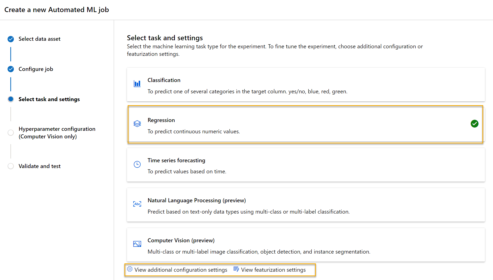

---
lab:
  title: "Explorer le machine learning automatisé dans Azure\_ML"
---

# Explorer le machine learning automatisé dans Azure ML

> **Remarque** Pour suivre ce labo, vous avez besoin d’un [abonnement Azure](https://azure.microsoft.com/free?azure-portal=true) dans lequel vous disposez d’un accès administratif.

Dans cet exercice, vous allez utiliser un jeu de données de détails historiques sur la location de vélos pour entraîner un modèle qui prédit le nombre de locations de vélos auquel vous pouvez vous attendre pour une journée donnée, en fonction des caractéristiques saisonnières et météorologiques.

## Création d’un espace de travail Microsoft Azure Machine Learning  

1. Connectez-vous au [portail Azure](https://portal.azure.com?azure-portal=true) en utilisant vos informations d’identification Microsoft.

1. Sélectionnez **+ Créer une ressource**, recherchez *Machine Learning*, puis créez une ressource **Azure Machine Learning** avec un plan *Azure Machine Learning*. Utilisez les paramètres suivants :
    - **Abonnement** : *votre abonnement Azure*.
    - **Groupe de ressources** : *créez ou sélectionnez un groupe de ressources*.
    - **Nom de l’espace de travail** : *entrez un nom unique pour votre espace de travail*.
    - **Région** : *sélectionnez la région géographique la plus proche*.
    - **Compte de stockage** : *notez le nouveau compte de stockage par défaut à créer pour votre espace de travail*.
    - **Coffre de clés** : *notez le nouveau coffre de clés par défaut, qui va être créé pour votre espace de travail*.
    - **Application Insights** : *notez la nouvelle ressource Application Insights par défaut, qui va être créée pour votre espace de travail*.
    - **Registre de conteneurs** : aucun (*un registre est créé automatiquement la première fois que vous déployez un modèle sur un conteneur*).

1. Sélectionnez **Vérifier + créer**, puis sélectionnez **Créer**. Attendez que votre espace de travail soit créé (cela peut prendre quelques minutes), puis accédez à la ressource déployée.

1. Sélectionnez **Lancer Studio** (ou ouvrez un nouvel onglet de navigateur, accédez à [https://ml.azure.com](https://ml.azure.com?azure-portal=true), puis connectez-vous à Azure Machine Learning Studio à l’aide de votre compte Microsoft).

1. Fermez tous les messages affichés.

1. Dans Azure Machine Learning Studio, vous devez voir l’espace de travail qui vient d’être créé. Si ce n’est pas le cas, sélectionnez votre annuaire Azure dans le menu de gauche. Ensuite, dans le nouveau menu de gauche, sélectionnez **Espaces de travail**, où tous les espaces de travail associés à votre annuaire sont listés, puis sélectionnez celui que vous avez créé pour cet exercice.

> **Remarque** Ce module fait partie de l’un des nombreux modules qui utilisent un espace de travail Azure Machine Learning, tout comme les autres modules du parcours d’apprentissage [Microsoft Azure AI - Notions fondamentales : Explorer les outils visuels pour le machine learning](https://docs.microsoft.com/learn/paths/create-no-code-predictive-models-azure-machine-learning/). Si vous utilisez votre propre abonnement Azure, vous pouvez éventuellement créer l’espace de travail une seule fois et le réutiliser dans d’autres modules. Une petite quantité de stockage de données est facturée dans votre abonnement Azure tant que l’espace de travail Azure Machine Learning existe dans votre abonnement. Nous vous recommandons donc de supprimer cet espace de travail dès qu’il n’est plus nécessaire.

## Créer une ressource de données

1. Affichez les données séparées par des virgules sur [https://aka.ms/bike-rentals](https://aka.ms/bike-rentals?azure-portal=true) dans votre navigateur web.

1. Dans [Azure Machine Learning studio](https://ml.azure.com?azure-portal=true), développez le volet gauche en sélectionnant l’icône de menu en haut à gauche de l’écran. Affichez la page **Données** (sous **Ressources**). La page Données contient des tables ou des fichiers de données spécifiques que vous prévoyez d’utiliser dans Azure Machine Learning. Vous pouvez aussi créer des jeux de données à partir de cette page.

1. Dans la page **Données**, sous l’onglet **Ressources de données**, sélectionnez **+ Créer**. Configurez ensuite une ressource de données avec les paramètres suivants :
    * **Type de données** :
        * **Nom**: bike-rentals
        * **Description** : données de location de vélos
        * **Type de jeu de données** : Tabulaire
    * **Source de données** : fichiers web
    * **URL web** :
        * **URL web** : [https://aka.ms/bike-rentals](https://aka.ms/bike-rentals?azure-portal=true)
        * **Ignorer la validation des données** : *ne pas sélectionner*
    * **Paramètres**:
        * **Format de fichier** : Délimité
        * **Délimiteur** : Virgule
        * **Encodage** : UTF-8
        * **En-têtes de colonnes** : seul le premier fichier comporte des en-têtes
        * **Ignorer les lignes** : Aucune
        * **Le jeu de données contient des données à plusieurs lignes** : *ne les sélectionnez pas*
    * **Schéma** :
        * Inclure toutes les colonnes autres que **Chemin**
        * Examiner les types détectés automatiquement
    * **Révision**
        * Sélectionnez **Créer**

1. Une fois que vous avez créé le jeu de données, ouvrez-le, puis affichez la page **Explorer** pour voir un échantillon des données. Ces données contiennent des étiquettes et des caractéristiques historiques de locations de vélos.

> **Citation** : *Ces données sont dérivées de [Capital Bikeshare](https://www.capitalbikeshare.com/system-data) et sont utilisées conformément au [contrat de licence](https://www.capitalbikeshare.com/data-license-agreement) des données publiées.*

## Activer le calcul serverless

1. Dans Azure Machine Learning Studio, cliquez sur **Gérer les fonctionnalités de préversion** (icône du haut-parleur).


1. Activez la fonctionnalité « Expérience guidée pour soumettre des travaux d’entraînement avec le calcul serverless ».


## Exécuter un travail de machine learning automatisé

Suivez les étapes ci-dessous pour exécuter un travail qui utilise le machine learning automatisé afin d’entraîner un modèle de régression pouvant prédire les locations de vélos.

1. Dans [Azure Machine Learning studio](https://ml.azure.com?azure-portal=true), consultez la page **ML automatisé** (sous **Création**).

1. Créez un travail de ML automatisé avec les paramètres suivants :
    - **Sélectionner une ressource de données** :
        - **Jeu de données** : bike-rentals
    - **Configurer le travail** :
        - **Nom de la nouvelle expérience** : mslearn-bike-rental
        - **Colonne cible** : rentals (*il s’agit de l’étiquette que le modèle est entraîné à prédire)*
        - **Sélectionner un cluster de calcul Azure ML** : *cluster de calcul que vous avez créé*.
    - **Sélectionnez la tâche et les paramètres** : 
        - **Type de tâche** : régression *(le modèle prédit une valeur numérique)* 

    

    Notez la présence des paramètres suivants sous le type de tâche : *Voir des paramètres de configuration supplémentaires* et *Afficher les paramètres de caractérisation*. À présent, configurez ces paramètres.

    - **Paramètres de configuration supplémentaires** :
        - **Métrique principale** : sélectionnez **Erreur quadratique moyenne normalisée**
        - **Expliquer le meilleur modèle** : sélectionné — *Cette option fait en sorte que le Machine Learning automatisé calcule l’importance des caractéristiques pour le meilleur modèle, permettant ainsi de déterminer l’influence de chaque caractéristique sur l’étiquette prédite*.
        - **Utiliser tous les modèles pris en charge** : <u>Un</u>sélectionné. *Vous allez restreindre le travail pour essayer uniquement quelques algorithmes spécifiques.*
        - **Modèles autorisés** : *Sélectionnez uniquement **RandomForest** et **LightGBM**. Normalement, vous pouvez en essayer autant que possible, mais chaque modèle ajouté augmente le temps nécessaire à l’exécution du travail.*

        
Notez que sous *Voir des paramètres de configuration supplémentaires* se trouve une section *Limites*. Développez la section pour configurer les paramètres :
        - **Délai d’expiration (minutes)**  : 30 — *met fin au travail après un délai maximal de 30 minutes.*
        - **Seuil de score de métrique** : 0,085 - *si un modèle atteint un score de métrique d’erreur quadratique moyenne normalisée égal ou inférieur à 0,085, le travail prend fin.*
        - Cliquez sur **Suivant**.
        - **Calcul** : aucun changement nécessaire ici
        - Cliquez sur **Suivant**.
1. Une fois que vous avez fini d’envoyer les détails du travail de machine learning automatisé, celui-ci démarre automatiquement.

1. Attendez que le travail se termine. Cela risque de prendre un certain temps, c’est peut-être le moment de faire une pause café !

## Examiner le meilleur modèle

1. Sous l’onglet **Vue d’ensemble** du travail de machine learning automatisé, notez le meilleur récapitulatif du modèle.
    

    > **Remarque** : Vous pouvez voir un message sous l’état « Avertissement : Score de sortie spécifié pour l’utilisateur atteint... ». Il s’agit d’un message attendu. Passez à l’étape suivante.  
1. Sélectionnez le texte sous **Nom de l’algorithme** correspondant au meilleur modèle pour voir ses détails.

1. À côté de la valeur *Erreur quadratique moyenne normalisée*, sélectionnez **Afficher toutes les autres métriques** pour voir les valeurs d’autres métriques d’évaluation possibles d’un modèle de régression.

    

1. Sélectionnez l’onglet **Métriques** et sélectionnez les graphiques de **résiduels** et de comparaison **valeurs prédites-valeurs réelles** s’ils ne sont pas déjà sélectionnés. 
    

    Regardez les graphiques qui montrent les performances du modèle. Le premier graphique montre les *résidus*, les différences entre les valeurs prédites et réelles, sous la forme d’un histogramme. Le deuxième graphique compare les valeurs prédites aux valeurs réelles.

1. Sélectionnez l’onglet **Explications**. Sélectionnez un ID d’explication, puis sélectionnez **Importance des caractéristiques agrégées**. Ce graphe indique dans quelle mesure chacune des caractéristiques du jeu de données influence la prédiction d’étiquette :

    

## Déployer un service prédictif

1. Dans [Azure Machine Learning Studio](https://ml.azure.com?azure-portal=true), dans la page **ML automatisé**, sélectionnez votre travail de machine learning automatisé.

1. Sous l’onglet **Vue d’ensemble**, sélectionnez le nom de l’algorithme du meilleur modèle.

    

1. Sous l’onglet **Modèles**, sélectionnez le bouton **Déployer**, puis utilisez l’option **Service web** pour déployer le modèle avec les paramètres suivants :
    - **Nom** : prédiction-locations
    - **Description** : Prédire les locations de vélos
    - **Type de capacité de calcul** : Instance de conteneur Azure
    - **Activer l’authentification** : Sélectionné

1. Attendez que le déploiement commence. Cette opération peut prendre quelques secondes.

1. Dans le menu de gauche d’Azure Machine Learning studio, sélectionnez **Points de terminaison** et ouvrez le point de terminaison **predict-rentals** en temps réel.
1. Attendez que l’**état du déploiement** passe à **Sain** (ce qui peut prendre quelques minutes).

## Tester le service déployé

Vous pouvez maintenant tester votre service déployé.

1. Dans la page du point de terminaison en temps réel **predict-rentals**, l’onglet **Test** s’affiche.

1. Dans le volet **Entrer des données pour tester le point de terminaison**, remplacez le modèle JSON par les données de l’entrée suivante :

    ```JSON
    {
      "Inputs": { 
        "data": [
          {
            "day": 1,
            "mnth": 1,   
            "year": 2022,
            "season": 2,
            "holiday": 0,
            "weekday": 1,
            "workingday": 1,
            "weathersit": 2, 
            "temp": 0.3, 
            "atemp": 0.3,
            "hum": 0.3,
            "windspeed": 0.3 
          }
        ]    
      },   
      "GlobalParameters": 1.0
    }
    ```

1. Cliquez sur le bouton **Tester**.

1. Consultez les résultats des tests, qui incluent un nombre prévu de locations basé sur les fonctionnalités d’entrée. Le volet Tester a récupéré les données d’entrée et a utilisé le modèle sur lequel vous avez effectué l'apprentissage pour retourner le nombre prévu de locations.

    

Passons en revue les opérations que vous avez effectuées. Vous avez utilisé un jeu de données de données historiques sur la location de bicyclettes pour effectuer l’apprentissage d’un modèle. Le modèle prédit le nombre de locations de bicyclettes attendues pour un jour donné, en fonction des *caractéristiques* saisonnières et météorologiques. Dans ce cas, les *étiquettes* sont le nombre de locations de bicyclettes.

Vous venez de tester un service prêt à être connecté à une application cliente à l’aide des informations d’identification de l’onglet **Consommer**. Nous allons terminer le labo ici. Nous vous invitons à poursuivre votre expérimentation avec le service que vous venez de déployer.

## Nettoyage

Le service web que vous avez créé est hébergé dans une *instance de conteneur Azure*. Si vous n’envisagez pas d’effectuer d’autres expériences avec celui-ci, vous devez supprimer le point de terminaison afin d’éviter une utilisation d’Azure non nécessaire. Vous devez aussi supprimer le cluster de calcul.

1. Dans [Azure Machine Learning Studio](https://ml.azure.com?azure-portal=true), sous l’onglet **Points de terminaison**, sélectionnez le point de terminaison **prédiction-locations**. Sélectionnez ensuite **Supprimer**, puis confirmez la suppression du point de terminaison.

> **Remarque** La suppression du calcul fait que votre abonnement ne sera pas facturé pour les ressources de calcul. Une petite quantité de stockage de données vous est cependant facturée tant que l’espace de travail Azure Machine Learning existe dans votre abonnement. Si vous avez terminé l’exploration d’Azure Machine Learning, vous pouvez supprimer l’espace de travail Azure Machine Learning et les ressources associées. Toutefois, si vous envisagez de suivre d’autres labos de cette série, vous devrez le recréer.
>
> Pour supprimer votre espace de travail, procédez comme suit :
> 1. Dans le [portail Azure](https://portal.azure.com?azure-portal=true), dans la page **Groupes de ressources**, ouvrez le groupe de ressources que vous avez spécifié lors de la création de votre espace de travail Azure Machine Learning.
> 2. Cliquez sur **Supprimer le groupe de ressources**, tapez le nom du groupe de ressources pour confirmer que vous souhaitez le supprimer, puis sélectionnez **Supprimer**.
