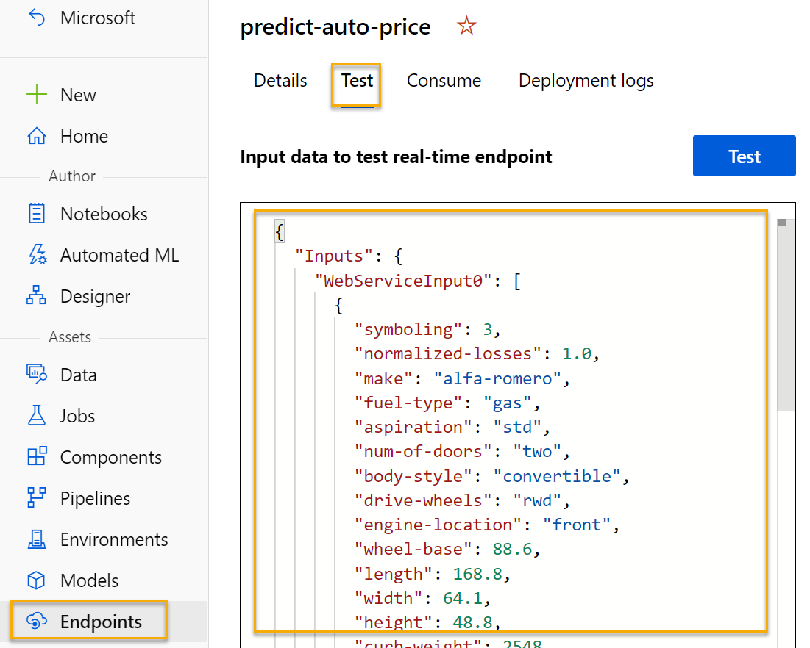

---
lab:
  title: Explorer la régression avec le concepteur Azure Machine Learning
---

# Explorer la régression avec le concepteur Azure Machine Learning

> **Remarque** Pour suivre ce labo, vous avez besoin d’un [abonnement Azure](https://azure.microsoft.com/free?azure-portal=true) dans lequel vous disposez d’un accès administratif.

Dans cet exercice, vous allez effectuer l’apprentissage d’un modèle de régression qui prédit le prix d’une voiture en fonction de ses spécifications.

## Création d’un espace de travail Microsoft Azure Machine Learning  

1. Connectez-vous au [portail Azure](https://portal.azure.com?azure-portal=true) en utilisant vos informations d’identification Microsoft.

1. Sélectionnez **+ Créer une ressource**, recherchez *Machine Learning*, puis créez une ressource **Azure Machine Learning** avec un plan *Azure Machine Learning*. Utilisez les paramètres suivants :
    - **Abonnement** : *votre abonnement Azure*.
    - **Groupe de ressources** : *créez ou sélectionnez un groupe de ressources*.
    - **Nom de l’espace de travail** : *entrez un nom unique pour votre espace de travail*.
    - **Région** : *sélectionnez la région géographique la plus proche*.
    - **Compte de stockage** : *notez le nouveau compte de stockage par défaut à créer pour votre espace de travail*.
    - **Coffre de clés** : *notez le nouveau coffre de clés par défaut, qui va être créé pour votre espace de travail*.
    - **Application Insights** : *notez la nouvelle ressource Application Insights par défaut, qui va être créée pour votre espace de travail*.
    - **Registre de conteneurs** : aucun (*un registre est créé automatiquement la première fois que vous déployez un modèle sur un conteneur*)

1. Sélectionnez **Vérifier + créer**, puis sélectionnez **Créer**. Attendez que votre espace de travail soit créé (cela peut prendre quelques minutes), puis accédez à la ressource déployée.

1. Sélectionnez **Lancer Studio** (ou ouvrez un nouvel onglet de navigateur, accédez à [https://ml.azure.com](https://ml.azure.com?azure-portal=true), puis connectez-vous à Azure Machine Learning Studio à l’aide de votre compte Microsoft).

1. Dans Azure Machine Learning Studio, vous devez voir l’espace de travail qui vient d’être créé. Si ce n’est pas le cas, sélectionnez votre annuaire Azure dans le menu de gauche. Ensuite, dans le nouveau menu de gauche, sélectionnez **Espaces de travail**, où tous les espaces de travail associés à votre annuaire sont listés, puis sélectionnez celui que vous avez créé pour cet exercice.

> **Remarque** Ce module fait partie de l’un des nombreux modules qui utilisent un espace de travail Azure Machine Learning, tout comme les autres modules du parcours d’apprentissage [Microsoft Azure AI - Notions fondamentales : Explorer les outils visuels pour le machine learning](https://docs.microsoft.com/learn/paths/create-no-code-predictive-models-azure-machine-learning/). Si vous utilisez votre propre abonnement Azure, vous pouvez éventuellement créer l’espace de travail une seule fois et le réutiliser dans d’autres modules. Une petite quantité de stockage de données est facturée dans votre abonnement Azure tant que l’espace de travail Azure Machine Learning existe dans votre abonnement. Nous vous recommandons donc de supprimer cet espace de travail dès qu’il n’est plus nécessaire.

## Créer une capacité de calcul

1. Dans [Azure Machine Learning studio](https://ml.azure.com?azure-portal=true), sélectionnez l’icône **&#8801;** (une icône de menu qui figure un empilement de trois lignes) à gauche pour voir les différentes pages de l’interface (il peut être nécessaire d’agrandir au maximum la taille de votre écran). Vous pouvez utiliser ces pages du volet de gauche pour gérer les ressources dans votre espace de travail. Sélectionnez la page **Calcul** (sous **Gérer**).

1. Dans la page **Calcul**, sélectionnez l’onglet **Clusters de calcul**, puis ajoutez un nouveau cluster de calcul avec les paramètres suivants pour entraîner un modèle Machine Learning :
    - **Localisation** : *Sélectionnez la même localisation que celle de votre espace de travail. Si cette localisation n’est pas listée, choisissez celle qui est la plus proche de vous*.
    - **Niveau de machine virtuelle** : dédié
    - **Type de machine virtuelle** : Processeur
    - **Taille de machine virtuelle** :
        - Choisir **Sélectionner parmi toutes les options**
        - Rechercher et sélectionner **Standard_DS11_v2**
    - Sélectionnez **Suivant**.
    - **Nom de la capacité de calcul** : *entrez un nom unique*
    - **Nombre minimal de nœuds** : 0
    - **Nombre maximal de nœuds** : 2
    - **Secondes d’inactivité avant le scale-down** : 120
    - **Activer l’accès SSH** : ne pas cocher
    - Sélectionnez **Créer**

> **Remarque** Les clusters et les instances de calcul sont basés sur des images de machines virtuelles Azure standard. Pour ce module, l’image *Standard_DS11_v2* est recommandée pour obtenir un équilibre optimal entre coûts et performances. Si votre abonnement s’accompagne d’un quota qui ne couvre pas cette image, choisissez-en une autre. Gardez cependant à l’esprit qu’une image plus grande peut entraîner des coûts plus élevés, tandis qu’une plus petite risque de ne pas suffire pour effectuer les tâches. Vous pouvez également demander à votre administrateur Azure d’étendre votre quota.

La création du cluster de calcul prend du temps. Vous pouvez passer à l’étape suivante en attendant.

## Créer un pipeline dans Designer et ajouter un jeu de données

Azure Machine Learning comprend un exemple de jeu de données que vous pouvez utiliser pour votre modèle de régression.

1. Dans [Azure Machine Learning studio](https://ml.azure.com?azure-portal=true), développez le volet gauche en sélectionnant l’icône de menu en haut à gauche de l’écran. Affichez la page **Concepteur** (sous **Création**), puis sélectionnez **+** pour créer un pipeline.

1. Remplacez le nom du brouillon (**Pipeline-Created-on-* date***) par **Apprentissage automatique de la facturation**.

1. À côté du nom du pipeline situé à gauche, sélectionnez l’icône en forme de flèche pour développer le panneau, s’il ne l’est pas déjà. Le panneau doit s’ouvrir par défaut sur le volet **Bibliothèque de ressources**, indiqué par l’icône de livres en haut du panneau. Il contient une barre de recherche permettant de localiser les ressources dans le volet ainsi que deux boutons, **Données** et **Composant**.

    

1. Sélectionner un **composant**. Recherchez et placez le jeu de données **Automobile price data (Raw)** sur le canevas.

1. Cliquez avec le bouton droit (Ctrl+clic sur un Mac) sur le jeu de données **Données de prix automobile (Raw)** dans le canevas et cliquez sur **Aperçu des données**.

1. Examinez le schéma *Dataset output* (Sortie de jeu de données) des données. Vous pouvez voir les distributions des différentes colonnes sous forme d’histogrammes.

1. Faites défiler vers la droite du jeu de données jusqu’à voir la colonne **Price**, qui correspond à l’étiquette que votre modèle prédit.

1. Faites défiler vers la gauche et sélectionnez l’en-tête de colonne **normalized-losses**. Examinez ensuite les statistiques de cette colonne. Notez qu’il y a un certain nombre de valeurs manquantes dans cette colonne. Les valeurs manquantes limitent l’utilité de la colonne pour prédire l’étiquette **price**, donc vous voudrez probablement l’exclure de l’entraînement.

1. Fermez la fenêtre **DataOutput** pour afficher le jeu de données sur le canevas, comme ceci :

    

## Ajouter des transformations de données

En général, vous appliquez des transformations de données pour préparer les données en vue de la modélisation. Dans le cas des données sur le prix des véhicules, vous ajoutez des transformations pour traiter les problèmes que vous avez identifiés quand vous avez exploré les données.

1. Dans le volet **Bibliothèque de ressources** sur la gauche, sélectionnez **Composants** qui contiennent un large éventail de modules pour la transformation des données et l’entraînement du modèle. Vous pouvez aussi utiliser la barre de recherche pour localiser rapidement les modules.

1. Recherchez un module **Select Columns in Dataset** et positionnez-le dans le canevas sous le module **Automobile price data (Raw)**. Ensuite, connectez la sortie en bas du module **Automobile price data (Raw)** à l’entrée en haut du module **Select Columns in Dataset**, comme suit :

    

1. Double-cliquez sur le module **Select Columns in Dataset** pour accéder à un volet de paramètres situé sur la droite. Sélectionnez **Modifier la colonne**. Ensuite, dans la fenêtre **Sélectionner des colonnes**, sélectionnez **Par nom** et **Ajouter tout** pour ajouter toutes les colonnes. Supprimez ensuite **normalized-losses**, de sorte que votre sélection de colonne finale ressemble à ceci :

    

1. Sélectionnez **Enregistrer**, puis fermez la fenêtre propriétés.

Dans le reste de cet exercice, vous allez effectuer des étapes pour créer un pipeline ressemblant à ceci :


Suivez les étapes restantes en utilisant l’image pour référence quand vous ajoutez et configurez les modules requis.

1. Dans la **Bibliothèque de ressources**, recherchez un module **Nettoyer les données manquantes**, puis placez-le sous le module **Sélectionner des colonnes dans le jeu de données** sur le canevas. Ensuite, connectez la sortie du module **Select Columns in Dataset** à l’entrée du module **Clean Missing Data**.

1. Double-cliquez sur le module **Clean Missing Data**, puis dans le volet à droite, sélectionnez **Modifier la colonne**. Dans la fenêtre **Colonnes à nettoyer**, sélectionnez **Avec règles**, dans la liste **Inclure**, sélectionnez **Noms de colonnes**, puis dans la zone des noms de colonnes, entrez **bore**, **stroke** et **horsepower** de la façon suivante :

    

1. Avec le module **Clean Missing Data** toujours sélectionné, dans le volet à droite, définissez les paramètres de configuration suivants :
    - **Minimum missing value ratio** : 0.0
    - **Maximum missing value ratio** : 1.0
    - **Cleaning mode** : Remove entire row

    >**Conseil** Si vous visualisez les statistiques des colonnes **bore**, **stroke** et **horsepower**, vous verrez un certain nombre de valeurs manquantes. Ces colonnes présentent moins de valeurs manquantes que **normalized-losses**, donc elles sont susceptibles d’être utiles pour prédire l’étiquette **price** une fois que vous excluez de l’entraînement les lignes où les valeurs sont manquantes.

1. Dans la **Bibliothèque de composants**, recherchez un module **Normalize Data** et positionnez-le sur le canevas, sous le module **Clean Missing Data**. Ensuite, connectez la sortie la plus à gauche du module **Clean Missing Data** à l’entrée du module **Normalize Data**.

1. Double-cliquez sur le module **Normalize Data** pour afficher son volet Paramètres. Vous devez spécifier la méthode de transformation et les colonnes à transformer. Affectez à la méthode de transformation la valeur **MinMax**. Appliquez une règle en sélectionnant **Modifier la colonne** pour inclure les **noms de colonne** suivants :
    - **symboling**
    - **wheel-base**
    - **length**
    - **width**
    - **height**
    - **curb-weight**
    - **engine-size**
    - **bore**
    - **stroke**
    - **compression-ratio**
    - **horsepower**
    - **peak-rpm**
    - **city-mpg**
    - **highway-mpg**

    

    >**Astuce** Si vous comparez les valeurs des colonnes **stroke**, **peak-rpm** et **city-mpg**, elles sont toutes mesurées à des échelles différentes. Il est possible que les valeurs plus élevées de **peak-rpm** biaisent l’algorithme d’entraînement et créent une dépendance excessive sur cette colonne par rapport aux colonnes ayant des valeurs inférieures, par exemple **stroke**. Généralement, les scientifiques des données atténuent ce biais éventuel en *normalisant* les colonnes numériques pour les avoir à des échelles similaires.

## Exécuter le pipeline

Pour appliquer vos transformations de données, vous devez exécuter le pipeline.

1. Vérifiez que votre pipeline ressemble à cette image :

    

1. Sélectionnez **Configurer & soumettre** en haut de la page pour ouvrir la boîte de dialogue **Configurer la tâche de pipeline**.

1. Dans la page **De base**, sélectionnez **Créer** et définissez le nom de l’expérience sur **mslearn-auto-training**, puis sélectionnez **Suivant**.

1. Dans la page **Entrées & sorties**, sélectionnez **Suivant** sans apporter de modifications.

1. Une erreur s’affiche dans la page **Paramètres d’exécution**, car vous n’avez pas de calcul par défaut pour exécuter le pipeline. Dans la liste déroulante **Sélectionner un type de calcul**, sélectionnez *Cluster de calcul* et, dans la liste déroulante **Sélectionner un cluster de calcul Azure ML**, sélectionnez votre cluster de calcul récemment créé.

1. Sélectionnez **Suivant** pour examiner le travail de pipeline, puis **Envoyer** pour exécuter le pipeline d’entraînement.

1. Attendez quelques minutes que l’exécution se termine. Vous pouvez vérifier l’état du travail en sélectionnant **Travaux** sous **Ressources**. À partir de là, sélectionnez le travail **Apprentissage automatique de la facturation**. À partir de là, vous pouvez voir quand le travail est terminé. Une fois que le travail est terminé, le jeu de données est préparé pour l’entraînement du modèle.

1. Accédez au menu de gauche. Sous **Création**, sélectionnez **Concepteur**. Sélectionnez ensuite votre pipeline *Auto Price Training* dans la liste des **Pipelines**.

## Créer un pipeline d’apprentissage

Après avoir utilisé des transformations de données pour préparer les données, vous pouvez vous en servir pour entraîner un modèle Machine Learning. Procédez comme suit pour étendre le pipeline **Auto Price Training**.

1. Vérifiez que le menu de gauche a **Concepteur** sélectionné et que vous êtes retourné au pipeline **Auto Price Training**.

1. Dans le volet **Bibliothèque de ressources** sur la gauche, recherchez et placez un module **Découper les données** sur le canevas, sous le module **Normaliser les données**. Connectez ensuite la sortie *Transformed Dataset* (à gauche) du module **Normalize Data** à l’entrée du module **Split Data**.

    >**Conseil** Utilisez la barre de recherche pour localiser rapidement les modules. 

1. Double-cliquez sur le module **Découper les données**, puis configurez ses paramètres de la façon suivante :
    - **Splitting mode** : Split Rows
    - **Fraction of rows in the first output dataset** : 0.7
    - **Fractionnement aléatoire** : True
    - **Random seed** : 123
    - **Stratified split** : False

1. Dans la **Bibliothèque de ressources**, recherchez et placez un module **Entraîner le modèle** sur le canevas, sous le module **Découper les données**. Connectez ensuite la sortie de *Jeu de données1 de résultats* (à gauche) du module **Découper les données** à l’entrée de *Jeu de données* (à droite) du module **Entraîner le modèle**.

1. Le modèle que nous entraînons prédit la valeur **price**. Vous allez donc sélectionner le module **Entraîner le modèle**, et modifier ses paramètres pour affecter **price** (en respectant strictement la casse et l’orthographe) à la **colonne Label**.

    L’étiquette **price** qui sera prédite par le modèle est une valeur numérique. Nous devons donc entraîner le modèle à l’aide d’un algorithme de *régression*.

1. Dans la **Bibliothèque de ressources**, recherchez et placez un module **Régression linéaire** sur le canevas, à gauche du module **Découper les données** et au-dessus du module **Entraîner le modèle**. Ensuite, connectez sa sortie à l’entrée **Untrained model** (à gauche) du module **Train Model**.

    > **Remarque** Il existe plusieurs algorithmes qui vous permettent d’entraîner un modèle de régression. Pour choisir plus facilement, consultez [Aide-mémoire de l’algorithme Machine Learning pour le concepteur Azure Machine Learning](https://aka.ms/mlcheatsheet?azure-portal=true).

    Pour tester le modèle entraîné, nous devons l’utiliser pour déterminer le *score* du jeu de données de validation que nous avons retenu au moment du découpage des données d’origine ; en d’autres termes, prédire les étiquettes des caractéristiques contenues dans le jeu de données de validation.
 
1. Dans la **Bibliothèque de ressources**, recherchez et placez un module **Affecter un score au modèle** sur le canevas, sous le module **Entraîner le modèle**. Ensuite, connectez la sortie du module **Train Model** à l’entrée **Trained model** (à gauche) du module **Score Model** et faites glisser la sortie **Results dataset2** (à droite) du module **Split Data** vers l’entrée **Dataset** (à droite) du module **Score Model**.

1. Vérifiez que votre pipeline ressemble à cette image :

    

## Exécuter le pipeline d’entraînement

Vous êtes maintenant prêt à exécuter le pipeline d’entraînement et à entraîner le modèle.

1. Sélectionnez **Configurer & soumettre**, puis exécutez le pipeline à l’aide de l’expérience existante nommée **mslearn-auto-training**.

1. L’exécution de l’expérience prendra au moins 5 minutes. Revenez à la page **Travaux** et sélectionnez la dernière exécution du travail **Apprentissage automatique de la facturation**.

1. Une fois l’exécution de l’expérience terminée, cliquez avec le bouton droit sur le module **Score model**, sélectionnez **Aperçu des données**, puis **Jeu de données évalué** pour afficher les résultats.

1. Faites défiler l’affichage vers la droite. Vous noterez qu’à côté de la colonne **price** (qui contient les véritables valeurs connues de l’étiquette), il existe une nouvelle colonne nommée **Scored Labels**, qui contient les valeurs prédites de l’étiquette.

1. Fermer l’onglet **scored_dataset**.

Le modèle prédit les valeurs de l’étiquette **price**, mais dans quelle mesure ses prédictions sont-elles fiables ? Pour le déterminer, vous devez évaluer le modèle.

## Évaluer le modèle

Une façon d’évaluer un modèle de régression consiste à comparer les étiquettes prédites aux étiquettes réelles dans le jeu de données de validation retenu pendant l’apprentissage. Une autre méthode consiste à comparer les performances de plusieurs modèles.

1. Ouvrez le pipeline **Auto Price Training** que vous avez créé.

1. Dans la **Bibliothèque de ressources**, recherchez et placez un module **Évaluer le modèle** sur le canevas, sous le module **Affecter un score au modèle**, puis connectez la sortie du module **Affecter un score au modèle** à l’entrée de **Jeu de données avec score** (à gauche) du module **Évaluer le modèle**.

1. Vérifiez que votre pipeline ressemble à ceci :

    

1. Sélectionnez **Configurer & soumettre**, puis exécutez le pipeline à l’aide de l’expérience existante nommée **mslearn-auto-training**.

1. L’exécution de l’expérience prend quelques minutes. Revenez à la page **Travaux** et sélectionnez la dernière exécution du travail **Apprentissage automatique de la facturation**.

1. À la fin de l’exécution de l’expérience, sélectionnez **Détails du travail**, ce qui entraîne l’ouverture d’un autre onglet. Recherchez le module **Évaluer le modèle**, puis cliquez avec le bouton droit. Sélectionnez **Aperçu des données**, puis **Résultats de l’évaluation**.

    

1. Dans le volet *Résultats de l’évaluation*, examinez les métriques de performances de la régression :
    - **Erreur absolue moyenne (MAE)**
    - **Erreur quadratique moyenne (RMSE)**
    - **Erreur quadratique relative (RSE)**
    - **Erreur absolue relative (RAE)**
    - **Coefficient de détermination (R<sup>2</sup>)**
1. Fermez le volet *Résultats de l’évaluation*.

Une fois que vous avez identifié un modèle avec des métriques d’évaluation qui répondent à vos besoins, vous pouvez préparer l’utilisation de ce modèle avec de nouvelles données.

## Créer et exécuter un pipeline d’inférence

1. Accédez au menu au-dessus du canevas, puis sélectionnez **Créer un pipeline d’inférence**. Vous devrez peut-être passer en mode plein écran et cliquer sur l’icône d’ellipse **...** dans le coin supérieur droit de l’écran pour trouver **Créer un pipeline d’inférence** dans le menu.  

    

1. Dans la liste déroulante **Créer un pipeline d’inférence**, cliquez sur **Pipeline d’iInférence en temps réel**. Après quelques secondes, une nouvelle version de votre pipeline nommé **Auto Price Training-real time inference** est ouverte.

1. Renommez le nouveau pipeline en **Predict Auto Price**, puis passez en revue le nouveau pipeline. Il contient une entrée de service web pour les nouvelles données à soumettre et une sortie de service web pour retourner les résultats. Certaines des transformations et des étapes d’entraînement font partie de ce pipeline. Le modèle entraîné sera utilisé pour attribuer un score aux nouvelles données.

    Vous allez effectuer les modifications suivantes dans le pipeline d’inférence lors des étapes suivantes :

    

   Utilisez l’image comme référence lorsque vous modifierez le pipeline au cours des étapes suivantes.

1. Le pipeline d’inférence part du principe que les nouvelles données correspondent au schéma des données d’entraînement d’origine ; le jeu de données **Automobile price data (Raw)** du pipeline d’entraînement est donc inclus. Toutefois, ces données d’entrée comprennent l’étiquette **price** prédite par le modèle, qu’il n’est pas logique d’ajouter aux nouvelles données automobiles pour lesquelles une prédiction de prix n’a pas encore été effectuée. Supprimez ce module et remplacez-le par un module **Entrer des données manuellement** depuis la section **Entrée et sortie des données**.
1. Modifiez le module **Entrer des données manuellement** et entrez les données CSV suivantes, qui comprennent des valeurs de caractéristiques sans étiquette pour trois voitures (copiez et collez le bloc de texte entier) :

    ```CSV
    symboling,normalized-losses,make,fuel-type,aspiration,num-of-doors,body-style,drive-wheels,engine-location,wheel-base,length,width,height,curb-weight,engine-type,num-of-cylinders,engine-size,fuel-system,bore,stroke,compression-ratio,horsepower,peak-rpm,city-mpg,highway-mpg
    3,NaN,alfa-romero,gas,std,two,convertible,rwd,front,88.6,168.8,64.1,48.8,2548,dohc,four,130,mpfi,3.47,2.68,9,111,5000,21,27
    3,NaN,alfa-romero,gas,std,two,convertible,rwd,front,88.6,168.8,64.1,48.8,2548,dohc,four,130,mpfi,3.47,2.68,9,111,5000,21,27
    1,NaN,alfa-romero,gas,std,two,hatchback,rwd,front,94.5,171.2,65.5,52.4,2823,ohcv,six,152,mpfi,2.68,3.47,9,154,5000,19,26
    ```

1. Connectez le nouveau module **Entrer des données manuellement** à la même entrée **Jeu de données** du module **Sélectionner des colonnes dans le jeu de données** que le module **Entrée du service web**.

1. Le schéma des données entrantes étant changé pour exclure le champ **price**, vous devez supprimer toute utilisation explicite de ce champ dans les modules restants. Sélectionnez le module **Select Columns in Dataset**, puis, dans le volet Paramètres, modifiez les colonnes pour supprimer le champ **price**.

1. Le pipeline d’inférence comprend le module **Évaluer le modèle**, qui n’est pas utile pour la prédiction à partir des nouvelles données, vous pouvez le supprimer.

1. La sortie du module **Scorer le modèle** comprend toutes les caractéristiques d’entrée ainsi que l’étiquette prédite. Pour modifier la sortie de manière à inclure uniquement la prédiction :
    - Supprimez la connexion entre le module **Score Model** et le module **Web Service Output**.
    - Ajoutez un module **Exécuter un script Python** à partir de la section **Langage Python**, en remplaçant tout le script Python par défaut par le code suivant (qui sélectionne uniquement la colonne **Étiquettes scorées** et la renomme en **predicted_price**) :

    ```Python
    import pandas as pd

    def azureml_main(dataframe1 = None, dataframe2 = None):

        scored_results = dataframe1[['Scored Labels']]
        scored_results.rename(columns={'Scored Labels':'predicted_price'},
                        inplace=True)
     return scored_results
    ```
>**Remarque** : Le copier-coller peut introduire des espaces dans le script Python qui ne doivent pas être présents. Vérifiez une nouvelle fois qu’il n’y a pas d’espace avant *import*, *def* ou *return*. Assurez-vous qu’il existe une mise en retrait de tabulation avant *scored_results* et *scored_results.rename()*.

1. Connectez la sortie depuis le module **Score Model** pour l’entrée **Dataset1** (la plus à gauche) de **Exécuter le script Python**.

1. Connectez la sortie du **jeu de données Résultat** (gauche) du module **Exécuter le script Python** au module **Sortie du service web**.

1. Vérifiez que votre pipeline est similaire à l’image suivante :

    

1. Soumettez le pipeline en tant que nouvelle expérience nommée **mslearn-auto-inference** sur votre cluster de calcul. L’expérience peut prendre un certain temps.

1. Revenez à la page **Travaux** et sélectionnez la dernière exécution du travail **Apprentissage automatique de la facturation** (celle liée à l’expérience *mslearn-auto-inference*).

1. Une fois le pipeline terminé, cliquez avec le bouton droit sur le module **Exécuter le script Python** . Sélectionnez **Aperçu des données** puis **Jeu de données des résultats** afin d’afficher les prix prédits pour les trois voitures dans les données d’entrée.

1. Fermer l’onglet **Result_Dataset**.

Votre pipeline d’inférence prédit les prix des voitures en fonction de leurs caractéristiques. Vous êtes maintenant prêt à publier le pipeline afin que les applications clientes puissent l’utiliser.

## Déployer un modèle

Après avoir créé et testé un pipeline d’inférence pour l’inférence en temps réel, vous pouvez le publier en tant que service utilisable par les applications clientes.

> **Remarque** Dans cet exercice, vous allez déployer le service web sur une instance d’Azure Container Instances (ACI). Ce type de calcul, créé dynamiquement, est utile pour le développement et le test. Pour la production, vous devez créer un *cluster d’inférence* qui fournit un cluster Azure Kubernetes Service (AKS) offrant une meilleure scalabilité et une sécurité accrue.

## Déployer un service

1. Dans la page d’exécution du travail **Prédiction automatique du prix**, sélectionnez **Déployer** dans la barre de menus supérieure.

    

1. Dans l’écran de configuration, sélectionnez **Déployer un nouveau point de terminaison en temps réel** et utiliser les paramètres suivants :
    - **Nom** : predict-auto-price
    - **Description** : Régression automatique des prix
    - **Type de capacité de calcul** : Instance de conteneur Azure

1. Sélectionnez **Déployer** et patientez quelques minutes pendant le déploiement du service web.

## Testez le service

1. Dans la page **Points de terminaison**, ouvrez le point de terminaison en temps réel **predict-auto-price**.

    

1. Lorsque le point de terminaison **predict-auto-price** s’ouvre, sélectionnez l’onglet **Test**. Nous l’utiliserons pour tester notre modèle avec de nouvelles données. Supprimez les données actuelles sous **Données d’entrée pour tester le point de terminaison**. Copiez et collez les données ci-dessous dans la section Données :  

    ```json
    {
    "Inputs": {
                "WebServiceInput0":
                [
                    {
                        "symboling": 3,
                        "normalized-losses": 1.0,
                        "make": "alfa-romero",
                        "fuel-type": "gas",
                        "aspiration": "std",
                        "num-of-doors": "two",
                        "body-style": "convertible",
                        "drive-wheels": "rwd",
                        "engine-location": "front",
                        "wheel-base": 88.6,
                        "length": 168.8,
                        "width": 64.1,
                        "height": 48.8,
                        "curb-weight": 2548,
                        "engine-type": "dohc",
                        "num-of-cylinders": "four",
                        "engine-size": 130,
                        "fuel-system": "mpfi",
                        "bore": 3.47,
                        "stroke": 2.68,
                        "compression-ratio": 9,
                        "horsepower": 111,
                        "peak-rpm": 5000,
                        "city-mpg": 21,
                        "highway-mpg": 27
                    }
                ]
            },
    "GlobalParameters": {}
    }
    ```

1. Sélectionnez **Test**. Sur la droite de l’écran, vous devriez voir la sortie **« predicted_price ».** La sortie est le prix prédit pour un véhicule avec les caractéristiques spécifiées dans les données.

    

Passons en revue les opérations que vous avez effectuées. Vous avez nettoyé et transformé un jeu de données sur des automobiles, puis utilisé les *caractéristiques* de voitures pour effectuer l’apprentissage d’un modèle. Le modèle prédit le prix d’une automobile, qui est *l’étiquette*.

Vous avez également testé un service prêt à être connecté à une application cliente à l’aide des informations d’identification de l’onglet **Consommer**. Nous allons terminer le labo ici. Nous vous invitons à poursuivre votre expérimentation avec le service que vous venez de déployer.

## Nettoyage

Le service web que vous avez créé est hébergé dans une *instance de conteneur Azure*. Si vous n’envisagez pas d’effectuer d’autres expériences avec celui-ci, vous devez supprimer le point de terminaison afin d’éviter une utilisation d’Azure non nécessaire. Vous devez aussi supprimer le cluster de calcul.

1. Dans [Azure Machine Learning Studio](https://ml.azure.com?azure-portal=true), sous l’onglet **Points de terminaison**, sélectionnez le point de terminaison **predict-auto-price**. Sélectionnez ensuite **Supprimer**, puis confirmez la suppression du point de terminaison.

1. Dans la page **Calcul**, sous l’onglet **Clusters de calcul**, sélectionnez votre cluster de calcul, puis sélectionnez **Supprimer**.

>**Remarque** La suppression du calcul fait que votre abonnement ne sera pas facturé pour les ressources de calcul. Une petite quantité de stockage de données vous est cependant facturée tant que l’espace de travail Azure Machine Learning existe dans votre abonnement. Si vous avez terminé l’exploration d’Azure Machine Learning, vous pouvez supprimer l’espace de travail Azure Machine Learning et les ressources associées. Toutefois, si vous envisagez de suivre d’autres labos de cette série, vous devrez le recréer.
>
> Pour supprimer votre espace de travail, procédez comme suit :
>
> 1. Dans le [portail Azure](https://portal.azure.com?azure-portal=true), dans la page **Groupes de ressources**, ouvrez le groupe de ressources que vous avez spécifié lors de la création de votre espace de travail Azure Machine Learning.
> 1. Cliquez sur **Supprimer le groupe de ressources**, tapez le nom du groupe de ressources pour confirmer que vous souhaitez le supprimer, puis sélectionnez **Supprimer**.
