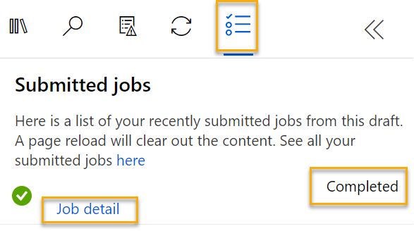
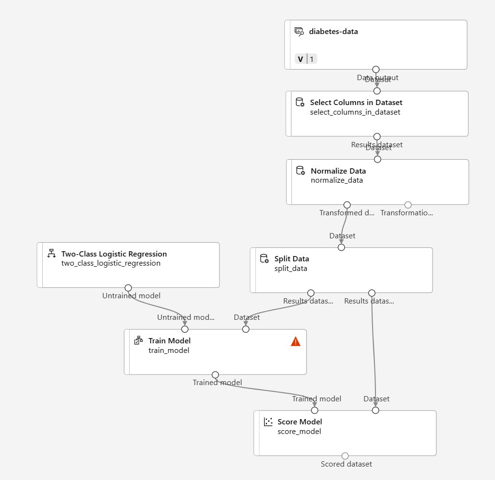

---
lab:
  title: Explorer la classification avec le concepteur Azure Machine Learning
---

# <a name="explore-classification-with-azure-machine-learning-designer"></a>Explorer la classification avec le concepteur Azure Machine Learning

> **Remarque** Pour suivre ce labo, vous avez besoin d’un [abonnement Azure](https://azure.microsoft.com/free?azure-portal=true) dans lequel vous disposez d’un accès administratif.

## <a name="create-an-azure-machine-learning-workspace"></a>Création d’un espace de travail Microsoft Azure Machine Learning  

1. Connectez-vous au [portail Azure](https://portal.azure.com?azure-portal=true) en utilisant vos informations d’identification Microsoft.

1. Sélectionnez **+ Créer une ressource**, recherchez *Machine Learning*, puis créez une ressource **Azure Machine Learning** avec un plan *Azure Machine Learning*. Utilisez les paramètres suivants :
    - **Abonnement** : *votre abonnement Azure*.
    - **Groupe de ressources** : *créez ou sélectionnez un groupe de ressources*.
    - **Nom de l’espace de travail** : *entrez un nom unique pour votre espace de travail*.
    - **Région** : *sélectionnez la région géographique la plus proche*.
    - **Compte de stockage** : *notez le nouveau compte de stockage par défaut à créer pour votre espace de travail*.
    - **Coffre de clés** : *notez le nouveau coffre de clés par défaut, qui va être créé pour votre espace de travail*.
    - **Application Insights** : *notez la nouvelle ressource Application Insights par défaut, qui va être créée pour votre espace de travail*.
    - **Registre de conteneurs** : aucun (*un registre est créé automatiquement la première fois que vous déployez un modèle sur un conteneur*)

1. Sélectionnez **Vérifier + créer**, puis sélectionnez **Créer**. Attendez que votre espace de travail soit créé (cela peut prendre quelques minutes), puis accédez à la ressource déployée.

1. Sélectionnez **Lancer Studio** (ou ouvrez un nouvel onglet de navigateur, accédez à [https://ml.azure.com](https://ml.azure.com?azure-portal=true), puis connectez-vous à Azure Machine Learning Studio à l’aide de votre compte Microsoft).

1. Dans Azure Machine Learning Studio, vous devez voir l’espace de travail qui vient d’être créé. Si ce n’est pas le cas, cliquez dans le menu de gauche sur **Microsoft**. Puis, dans le nouveau menu de gauche, sélectionnez **Espaces de travail**, où tous les espaces de travail associés à votre abonnement sont listés. Choisissez celui que vous avez créé pour cet exercice. 

> **Remarque** Ce module fait partie de l’un des nombreux modules qui utilisent un espace de travail Azure Machine Learning, tout comme les autres modules du parcours d’apprentissage [Microsoft Azure AI - Notions fondamentales : Explorer les outils visuels pour le machine learning](https://docs.microsoft.com/learn/paths/create-no-code-predictive-models-azure-machine-learning/). Si vous utilisez votre propre abonnement Azure, vous pouvez éventuellement créer l’espace de travail une seule fois et le réutiliser dans d’autres modules. Une petite quantité de stockage de données est facturée dans votre abonnement Azure tant que l’espace de travail Azure Machine Learning existe dans votre abonnement. Nous vous recommandons donc de supprimer cet espace de travail dès qu’il n’est plus nécessaire.

## <a name="create-compute"></a>Créer une capacité de calcul

1. Dans [Azure Machine Learning Studio](https://ml.azure.com?azure-portal=true), sélectionnez les trois lignes en haut à gauche pour voir les différentes pages de l’interface (vous devrez peut-être agrandir la fenêtre affichée à l’écran). Vous pouvez utiliser ces pages du volet de gauche pour gérer les ressources dans votre espace de travail. Sélectionnez la page **Calcul** (sous **Gérer**).

1. Dans la page **Calcul**, sélectionnez l’onglet **Clusters de calcul**, puis ajoutez un nouveau cluster de calcul avec les paramètres suivants. Vous l’utiliserez pour entraîner un modèle Machine Learning :
    - **Localisation** : *Sélectionnez la même localisation que celle de votre espace de travail. Si cette localisation n’est pas listée, choisissez celle qui est la plus proche de vous*.
    - **Niveau de machine virtuelle** : dédié
    - **Type de machine virtuelle** : Processeur
    - **Taille de machine virtuelle** :
        - Choisir **Sélectionner parmi toutes les options**
        - Rechercher et sélectionner **Standard_DS11_v2**
    - Sélectionnez **Suivant**.
    - **Nom de la capacité de calcul** : *entrez un nom unique*.
    - **Nombre minimal de nœuds** : 0
    - **Nombre maximal de nœuds** : 2
    - **Secondes d’inactivité avant le scale-down** : 120
    - **Activer l’accès SSH** : ne pas cocher
    - Sélectionnez **Créer**

> **Remarque** Les clusters et les instances de calcul sont basés sur des images de machines virtuelles Azure standard. Pour ce module, l’image *Standard_DS11_v2* est recommandée pour obtenir un équilibre optimal entre coûts et performances. Si votre abonnement s’accompagne d’un quota qui ne couvre pas cette image, choisissez-en une autre. Gardez cependant à l’esprit qu’une image plus grande peut entraîner des coûts plus élevés, tandis qu’une plus petite risque de ne pas suffire pour effectuer les tâches. Vous pouvez également demander à votre administrateur Azure d’étendre votre quota.

La création du cluster de calcul prend du temps. Vous pouvez passer à l’étape suivante en attendant.

## <a name="create-a-pipeline-in-designer"></a>Créer un pipeline dans le concepteur

Pour commencer à utiliser le concepteur Azure Machine Learning, vous devez d’abord créer un pipeline et ajouter le jeu de données que vous souhaitez utiliser.

1. Dans [Azure Machine Learning Studio](https://ml.azure.com?azure-portal=true), développez le volet gauche en sélectionnant les trois lignes en haut à gauche de l’écran. Affichez la page **Concepteur** (sous **Créer**), puis sélectionnez **+** pour créer un pipeline.

1. En haut à droite de l’écran, sélectionnez **Paramètres**. Si le volet **Paramètres** n’est pas visible, sélectionnez l’icône en forme de roue à côté du nom du pipeline situé en haut.

1. Dans **Paramètres**, vous devez spécifier une cible de calcul sur laquelle exécuter le pipeline. Sous **Sélectionner le type de capacité de calcul**, sélectionnez **Cluster de calcul**. Sous **Sélectionner un cluster de calcul Azure ML**, sélectionnez le cluster de calcul que vous avez créé.

1. Dans **Paramètres**, sous **Détails du brouillon**, remplacez le nom du brouillon (**Pipeline-Created-on-* date***) par **Diabetes Training**.

1. Sélectionnez l’icône de fermeture en haut à droite du volet **Paramètres** pour fermer le volet, puis sélectionnez **Enregistrer**.

    

## <a name="create-a-dataset"></a>Créer un jeu de données

1. Dans [Azure Machine Learning Studio](https://ml.azure.com?azure-portal=true), développez le volet gauche en sélectionnant les trois lignes en haut à gauche de l’écran. Affichez la page **Données** (sous **Ressources**). La page Données contient des tables ou des fichiers de données spécifiques que vous prévoyez d’utiliser dans Azure Machine Learning. Vous pouvez aussi créer des jeux de données à partir de cette page.

1. Dans la page **Données**, sous l’onglet **Ressources de données**, sélectionnez **Créer**. Configurez ensuite une ressource de données avec les paramètres suivants :
    * **Type de données** :
        * **Nom** : diabetes-data
        * **Description** : Données sur le diabète
        * **Type de jeu de données** : Tabulaire
    * **Source de données** : fichiers web
    * **URL web** :
        * **URL web** : ****
        * **Ignorer la validation des données** : *ne pas sélectionner*
    * **Paramètres**:
        * **Format de fichier** : Délimité
        * **Délimiteur** : Virgule
        * **Encodage** : UTF-8
        * **En-têtes de colonnes** : seul le premier fichier comporte des en-têtes
        * **Ignorer les lignes** : Aucune
        * **Le jeu de données contient des données à plusieurs lignes** : *ne les sélectionnez pas*
    * **Schéma** :
        * Inclure toutes les colonnes autres que **Chemin**
        * Examiner les types détectés automatiquement
    * **Révision**
        * Sélectionnez **Créer**

1. Après avoir créé le jeu de données, ouvrez-le, puis affichez la page **Explorer** pour voir un échantillon des données. Ces données représentent les détails des patients qui ont été testés pour le diabète.

### <a name="load-data-to-canvas"></a>Charger les données sur le canevas

1. Revenez à votre pipeline en sélectionnant **Concepteur** dans le menu de gauche. Dans la page **Concepteur**, sélectionnez le pipeline **Diabetes Training**.

1. Ensuite dans le projet, à côté du nom du pipeline situé à gauche, sélectionnez l’icône de flèches pour développer le panneau, s’il ne l’est pas déjà. Le panneau doit s’ouvrir par défaut sur le volet **Bibliothèque de ressources**, indiqué par l’icône de livres en haut du panneau. Notez qu’il existe une barre de recherche pour localiser les ressources. Notez deux boutons : **Données** et **Composant**.

    

1. Cliquez sur **Données**. Recherchez et placez le jeu de données **diabetes-data** sur le canevas.

1. Cliquez avec le bouton droit (Ctrl+clic sur un Mac) sur le jeu de données **diabetes-data** dans le canevas et cliquez sur **Preview data** (Aperçu des données).

1. Examinez le schéma des données dans l’onglet *Profil*. Vous pouvez voir les distributions des différentes colonnes sous forme d’histogrammes.

1. Faites défiler la page vers le bas et sélectionnez l’en-tête de la colonne **Diabetic**, qui contient les deux valeurs **0** et **1**. Ces valeurs représentent les deux classes possibles pour l’*étiquette* que votre modèle devra prédire : la valeur **0** signifie que le patient n’a pas de diabète et la valeur **1** indique que le patient est diabétique.

1. Refaites défiler la page vers le haut et regardez les autres colonnes, qui représentent les *caractéristiques* qui seront utilisées pour prédire l’étiquette. Notez que la plupart de ces colonnes sont numériques, mais que chaque caractéristique a sa propre échelle. Par exemple, les valeurs dans **Age** sont comprises entre 21 et 77, tandis que les valeurs **DiabetesPedigree** sont comprises entre 0.078 et 2.3016. Quand vous entraînez un modèle Machine Learning, il arrive parfois que les plus grandes valeurs dominent la fonction prédictive résultante, réduisant ainsi l’influence des caractéristiques sur une plus petite échelle. Généralement, les scientifiques des données atténuent ce biais éventuel en *normalisant* les colonnes numériques pour les avoir à des échelles similaires.

1. Fermez l’onglet **diabetes-data result visualization** (Visualisation des résultats de diabetes-data) pour voir le jeu de données sur le canevas, comme ceci :

    

## <a name="add-transformations"></a>Ajouter des transformations

Pour pouvoir entraîner un modèle, vous devez généralement appliquer au préalable certaines transformations de prétraitement aux données.

1. Dans le volet **Bibliothèque de ressources** sur la gauche, cliquez sur **Composants**, qui contient un large éventail de modules pour la transformation des données et l’entraînement du modèle. Vous pouvez aussi utiliser la barre de recherche pour localiser rapidement les modules.

    

1. Recherchez le module **Normaliser les données** et placez-le sur le canevas, sous le jeu de données **diabetes-data**. Connectez ensuite la sortie en bas du jeu de données **diabetes-data** à l’entrée en haut du module **Normalize Data**, comme suit :

    

1. Double-cliquez sur le module **Normalize Data** pour observer ses paramètres ; vous pouvez voir que vous devez spécifier la méthode de transformation et les colonnes à transformer. 

1. Affectez à la *Méthode de transformation* la valeur **MinMax**, et à *Utiliser 0 pour les colonnes constantes quand elles sont cochées* la valeur **True**. Modifiez les colonnes pour inclure les colonnes suivantes par nom, comme montré dans l’image :
    - **Pregnancies**
    - **PlasmaGlucose**
    - **DiastolicBloodPressure**
    - **TricepsThickness**
    - **SerumInsulin**
    - **BMI**
    - **DiabetesPedigree**
    - **Age**

    

La transformation des données normalise les colonnes numériques pour les mettre à la même échelle. Ainsi, les colonnes comportant des valeurs élevées ne devraient pas dominer l’entraînement du modèle. Vous devez généralement appliquer une série complète de transformations de prétraitement comme celle-ci afin de préparer vos données pour l’entraînement. Cependant, nous allons simplifier les choses pour cet exercice.

## <a name="run-the-pipeline"></a>Exécuter le pipeline

Pour appliquer vos transformations de données, vous devez exécuter le pipeline en tant qu’expérience.

1. Sélectionnez **Submit**, puis exécutez le pipeline en tant que nouvelle expérience nommée **mslearn-diabetes-training** sur votre cluster de calcul.

1. Attendez quelques minutes que l’exécution se termine.

    

    Notez que le panneau gauche se trouve maintenant sur le volet **Travaux envoyés**. Une fois le travail terminé, l’état du travail devient **Terminé**.

## <a name="view-the-transformed-data"></a>Afficher les données transformées

1. Une fois l’exécution terminée, le jeu de données est maintenant préparé pour l’apprentissage du modèle. Cliquez sur **Détail du travail**. Vous êtes redirigé vers un nouvel onglet.

1. Cliquez avec le bouton droit (Ctrl+clic sur Mac) sur le module **Normaliser les données** dans le canevas, puis cliquez sur **Aperçu des données**. Sélectionnez **Jeu de données transformé**.

1. Observez les données. Vous voyez que les colonnes numériques sélectionnées ont été normalisées pour avoir la même échelle.

1. Fermez la visualisation des résultats des données normalisées. Retournez à l’onglet précédent.

Après avoir utilisé des transformations de données pour préparer les données, vous pouvez vous en servir pour entraîner un modèle Machine Learning.

## <a name="add-training-modules"></a>Ajouter des modules d’entraînement

Il est courant d’entraîner le modèle avec un sous-ensemble des données, tout en gardant des données qui seront utilisées pour tester le modèle entraîné. Vous pourrez ainsi comparer les étiquettes prédites par le modèle avec les étiquettes réelles connues du jeu de données d’origine.

Dans cet exercice, vous allez suivre les différentes étapes pour étendre le pipeline **Diabetes Training** comme indiqué ici :



Effectuez les étapes suivantes en utilisant l’image ci-dessus pour référence quand vous ajoutez et configurez les modules requis.

1. Si ce n’est déjà fait, ouvrez le pipeline **Diabetes Training** que vous avez créé dans l’unité précédente.

1. Dans le volet **Bibliothèque de ressources** sur la gauche, dans **Composants**, recherchez et placez un module **Découper les données** sur le canevas, sous le module **Normaliser les données**. Connectez ensuite la sortie *Transformed Dataset* (à gauche) du module **Normalize Data** à l’entrée du module **Split Data**.

    >**Conseil** Utilisez la barre de recherche pour localiser rapidement les modules.

1. Sélectionnez le module **Split Data** et configurez ses paramètres comme suit :
    * **Splitting mode** : Split Rows
    * **Fraction of rows in the first output dataset** : 0.7
    * **Fractionnement aléatoire** : True
    * **Random seed** : 123
    * **Stratified split** : False

1. Dans la **Bibliothèque de ressources**, recherchez et placez un module **Entraîner le modèle** sur le canevas, sous le module **Découper les données**. Connectez ensuite la sortie de *Jeu de données1 de résultats* (à gauche) du module **Découper les données** à l’entrée de *Jeu de données* (à droite) du module **Entraîner le modèle**.

1. Le modèle que nous entraînons prédira la valeur **Diabetic**. Vous allez donc sélectionner le module **Train Model** et modifier ses paramètres : définissez la valeur **Label column** sur **Diabetic**.

    L’étiquette **Diabetic** qui sera prédite par le modèle est une classe (0 ou 1). Nous devons donc entraîner le modèle à l’aide d’un algorithme de *classification*. Plus précisément, il existe deux classes possibles. Nous avons donc besoin d’un algorithme de *classification binaire*.

1. Dans la **Bibliothèque de ressources**, recherchez et placez un module **Régression logistique à deux classes** sur le canevas, à gauche du module **Découper les données** et au-dessus du module **Entraîner le modèle**. Ensuite, connectez sa sortie à l’entrée **Untrained model** (à gauche) du module **Train Model**.

   Pour tester le modèle entraîné, nous devons l’utiliser pour déterminer le *score* du jeu de données de validation que nous avons retenu au moment du découpage des données d’origine ; en d’autres termes, prédire les étiquettes des caractéristiques contenues dans le jeu de données de validation.

1. Dans la **Bibliothèque de ressources**, recherchez et placez un module **Affecter un score au modèle** sur le canevas, sous le module **Entraîner le modèle**. Ensuite, connectez la sortie du module **Train Model** à l’entrée **Trained model** (à gauche) du module **Score Model** et connectez la sortie **Results dataset2** (à droite) du module **Split Data** à l’entrée **Dataset** (à droite) du module **Score Model**.

## <a name="run-the-training-pipeline"></a>Exécuter le pipeline d’entraînement

Vous êtes maintenant prêt à exécuter le pipeline d’entraînement et à entraîner le modèle.

1. Sélectionnez **Submit**, puis exécutez le pipeline à l’aide de l’expérience existante nommée **mslearn-diabetes-training**.

1. Attendez la fin de l’exécution de l’expérience. L’opération peut prendre 5 minutes ou plus.

1. À la fin de l’exécution de l’expérience, sélectionnez **Détails du travail**. Vous êtes redirigé vers un nouvel onglet.

1. Sous le nouvel onglet, cliquez avec le bouton droit (Ctrl+clic sur Mac) sur le module **Affecter un score au modèle** dans le canevas, puis cliquez sur **Aperçu des données**. Sélectionnez **Jeu de données évalué** pour afficher les résultats.

1. Faites défiler l’écran vers la droite. Vous pouvez voir, à côté de la colonne **Diabetic** (qui contient les valeurs réelles connues de l’étiquette), une nouvelle colonne nommée **Scored Labels**, qui contient les valeurs prédites de l’étiquette et une colonne **Scored Probabilities** contenant une valeur de probabilité comprise entre 0 et 1. Elle indique la probabilité de prédiction *positive* : les probabilités supérieures à 0.5 se traduisent par une étiquette prédite de ***1*** (diabétique), tandis que les probabilités comprises entre 0 et 0.5 se traduisent par une étiquette prédite de ***0*** (non diabétique).

1. Fermez l’onglet **Score Model result visualization**.

Le modèle prédit les valeurs de l’étiquette **Diabetic**, mais dans quelle mesure ses prédictions sont-elles fiables ? Pour le déterminer, vous devez évaluer le modèle.

Les données de validation que vous avez retenues et utilisées pour déterminer le score du modèle incluent les valeurs connues de l’étiquette. Pour valider le modèle, vous pouvez donc comparer les valeurs réelles de l’étiquette aux valeurs d’étiquette qui ont été prédites quand vous avez déterminé le score du jeu de données de validation. En fonction de cette comparaison, vous pouvez calculer différentes métriques qui décrivent la performance du modèle.

## <a name="add-an-evaluate-model-module"></a>Ajouter un module Evaluate Model

1. Ouvrez le pipeline **Diabetes Training** que vous avez créé.

1. Dans la **Bibliothèque de ressources**, recherchez et placez un module **Évaluer le modèle** sur le canevas, sous le module **Affecter un score au modèle**, puis connectez la sortie du module **Affecter un score au modèle** à l’entrée de **Jeu de données avec score** (à gauche) du module **Évaluer le modèle**.

1. Vérifiez que votre pipeline ressemble à ceci :

    

1. Sélectionnez **Submit**, puis exécutez le pipeline à l’aide de l’expérience existante nommée **mslearn-diabetes-training**.

1. Attendez la fin de l’exécution de l’expérience.

1. À la fin de l’exécution de l’expérience, sélectionnez **Détails du travail**. Vous êtes redirigé vers un nouvel onglet.

1. Sous le nouvel onglet, cliquez avec le bouton droit (Ctrl+clic sur Mac) sur le module **Évaluer le modèle** dans le canevas, puis cliquez sur **Aperçu des données**. Sélectionnez **Résultats de l’évaluation** pour afficher les métriques de performances. Ces métriques peuvent permettre aux scientifiques des données d’évaluer la performance de prédiction du modèle en fonction des données de validation.

1. Faites défiler vers le bas afin de voir la *matrice de confusion* pour le modèle. Observez le nombre de valeurs prédites et réelles pour chaque classe possible. 

1. Passez en revue les métriques à gauche de la matrice de confusion, à savoir :
    - **Justesse** : En d’autres termes, quelle est la proportion de prédictions de diabète correctes du modèle.
    - **Précision** : En d’autres termes, sur tous les patients que *le modèle prédit* comme ayant le diabète, le pourcentage de fois où le modèle est correct. 
    - **Rappel** : En d’autres termes, parmi tous les patients *ayant réellement* du diabète, combien de cas de diabète le modèle a-t-il correctement identifiés ?
    - **Score F1**

1. Utilisez le curseur **Seuil** situé au-dessus de la liste des métriques. Essayez de déplacer le curseur de seuil et observez l’effet sur la matrice de confusion. Si vous le positionnez complètement à gauche (0), la métrique Rappel devient 1. Si vous le positionnez complètement à droite (1), la métrique Rappel devient 0.

1. Regardez au-dessus du curseur Seuil dans la métrique **Courbe ROC** et **AUC** listée avec les autres métriques ci-dessous. Pour avoir une idée de la façon dont cette zone représente la performance du modèle, imaginez une ligne droite diagonale entre le coin inférieur gauche et le coin supérieur droit du graphique ROC. Ceci représente la performance attendue pour une estimation totalement aléatoire pour chaque patient, ce qui reviendrait à tirer à pile ou face : vous pourriez vous attendre à un résultat correct dans la moitié des cas (et à un résultat incorrect dans la moitié des cas) environ. La zone sous la ligne diagonale représente donc un AUC de 0.5. Si l’AUC de votre modèle est supérieure pour un modèle de classification binaire, alors il est plus performant qu’une estimation aléatoire.

1. Fermez l’onglet **Evaluate Model result visualization** (Visualisation des résultats de l’évaluation du modèle).

La performance de ce modèle n’est pas excellente, notamment parce que nous n’avons effectué qu’une caractérisation et un prétraitement minimes. Vous pouvez essayer un autre algorithme de classification, par exemple l’algorithme **Two-Class Decision Forest**, et comparer les résultats. Vous pouvez connecter les sorties du module **Split Data** à plusieurs modules **Train Model** et **Score Model** et vous pouvez connecter un deuxième module **Score Model** au module **Evaluate Model** pour voir une comparaison côte à côte. L’objectif de l’exercice est simplement de vous faire découvrir la classification et l’interface du concepteur Azure Machine Learning et non d’entraîner un modèle parfait.

## <a name="create-an-inference-pipeline"></a>Créer un pipeline d'inférence

1. Dans Azure Machine Learning Studio, développez le volet gauche en sélectionnant les trois lignes situées en haut à gauche de l’écran. Cliquez sur **Travaux** (sous **Ressources**) pour voir tous les travaux que vous avez exécutés. Sélectionnez l’expérience **mslearn-diabetes-training**, puis sélectionnez le pipeline **Diabetes Training**.

1. Recherchez le menu au-dessus du canevas, puis cliquez sur **Créer un pipeline d’inférence**. Vous devrez peut-être passer en mode plein écran et cliquer sur l’icône d’ellipse **...** dans le coin supérieur droit de l’écran pour trouver **Créer un pipeline d’inférence** dans le menu.  

    

1. Dans la liste déroulante **Create inference pipeline**, cliquez sur **Real-time inference pipeline**. Après quelques secondes, une nouvelle version de votre pipeline nommée **Diabetes Training-real time inference** s’ouvre.

1. Accédez à **Paramètres** dans le menu supérieur droit. Sous **Détail du brouillon**, renommez le nouveau pipeline **Predict Diabetes**, puis examinez-le. Certaines des transformations et des étapes d’entraînement font partie de ce pipeline. Le modèle entraîné est utilisé pour attribuer un score aux nouvelles données. Le pipeline contient également une sortie de service web pour retourner les résultats. 

    Vous allez apporter les modifications suivantes au pipeline d’inférence :

    
    
    - Ajoutez un composant **Entrée du service web** pour permettre l’envoi des nouvelles données.
    - Remplacez le jeu de données **diabetes-data** par un module **Entrer des données manuellement** qui n’inclut pas la colonne d’étiquette (**Diabetic**).
    - Supprimez le module **Evaluate Model**.
    - Insérez un module **Execute Python Script** avant la sortie du service web pour retourner uniquement l’ID patient, la valeur d’étiquette prédite et la probabilité.

1. Le pipeline n’inclut pas automatiquement de composant **Entrée du service web** pour les modèles créés à partir de jeux de données personnalisés. Recherchez un composant **Entrée du service web** dans la bibliothèque de ressources, puis placez-le en haut du pipeline. Connectez la sortie du composant **Entrée du service web** à l’entrée de droite du composant **Appliquer une transformation**, qui se trouve déjà sur le canevas.

1. Le pipeline d’inférence part du principe que les nouvelles données correspondent au schéma des données d’entraînement d’origine ; le jeu de données **diabetes-data** du pipeline d’entraînement est donc inclus. Cependant, ces données d’entrée incluent l’étiquette **Diabetic** prédite par le modèle, qui n’est pas incluse dans les nouvelles données de patient pour lesquelles aucune prédiction de diabète n’a encore été effectuée. Supprimez ce module et remplacez-le par un module **Entrer les données manuellement**, contenant les données CSV suivantes. Ces données incluent des valeurs de caractéristiques sans étiquettes pour trois nouvelles observations de patients :

    ```CSV
    PatientID,Pregnancies,PlasmaGlucose,DiastolicBloodPressure,TricepsThickness,SerumInsulin,BMI,DiabetesPedigree,Age
    1882185,9,104,51,7,24,27.36983156,1.350472047,43
    1662484,6,73,61,35,24,18.74367404,1.074147566,75
    1228510,4,115,50,29,243,34.69215364,0.741159926,59
    ```

1. Connectez le nouveau module **Enter Data Manually** à la même entrée **Dataset** du module **Apply Transformation** que le module **Web Service Input**.

1. Le pipeline d’inférence comprend le module **Évaluer le modèle**, qui n’est pas utile pour la prédiction à partir de nouvelles données : supprimez donc ce module.

1. La sortie du module **Score Model** comprend toutes les caractéristiques d’entrée ainsi que l’étiquette prédite et le score de probabilité. Pour limiter la sortie à la prédiction et à la probabilité uniquement :
    - Supprimez la connexion entre le module **Score Model** et le module **Web Service Output**.
    - Ajoutez un module **Exécuter le script Python** en remplaçant tout le script Python par défaut par le code suivant (qui sélectionne uniquement les colonnes **PatientID**, **Scored Labels** et **Scored Probabilities**, et les renomme de façon appropriée) :

```Python
import pandas as pd

def azureml_main(dataframe1 = None, dataframe2 = None):

    scored_results = dataframe1[['PatientID', 'Scored Labels', 'Scored Probabilities']]
    scored_results.rename(columns={'Scored Labels':'DiabetesPrediction',
                                'Scored Probabilities':'Probability'},
                        inplace=True)
    return scored_results
```

1. Connectez la sortie du module **Score Model** à l’entrée **Dataset1** (la plus à gauche) du module **Execute Python Script**, puis connectez la sortie du module **Execute Python Script** au module **Web Service Output**.

1. Vérifiez que votre pipeline est similaire à l’image suivante :

    

1. Exécutez le pipeline en tant que nouvelle expérience nommée **mslearn-diabetes-inference** sur votre cluster de calcul. L’expérience peut prendre un certain temps.

1. Une fois l’exécution du pipeline effectuée, sélectionnez **Détails du travail**. Sous le nouvel onglet, cliquez avec le bouton droit sur le module **Exécuter le script Python**. Sélectionnez **Aperçu des données**, puis **Jeu de données de résultats** afin de voir les étiquettes et les probabilités prédites pour les trois observations de patients dans les données d’entrée.

Votre pipeline d’inférence prédit si les patients présentent un risque de diabète en fonction de leurs caractéristiques. Vous êtes maintenant prêt à publier le pipeline pour que les applications clientes puissent l’utiliser.

Après avoir créé et testé un pipeline d’inférence pour l’inférence en temps réel, vous pouvez le publier en tant que service utilisable par les applications clientes.

> **Remarque** Dans cet exercice, vous allez déployer le service web sur une instance d’Azure Container Instances (ACI). Ce type de calcul, créé dynamiquement, est utile pour le développement et le test. Pour la production, vous devez créer un *cluster d’inférence* qui fournit un cluster Azure Kubernetes Service (AKS) offrant une meilleure scalabilité et une meilleure sécurité.

## <a name="deploy-a-service"></a>Déployer un service

1. Affichez le pipeline d’inférence **Predict Diabetes** que vous avez créé dans l’unité précédente.

1. Sélectionnez **Détails du travail** dans le volet gauche. Une autre fenêtre s’ouvre.

    

1. Dans la nouvelle fenêtre, sélectionnez **Déployer**.

    

1. En haut à droite, sélectionnez **Déployer** et déployez un **nouveau point de terminaison en temps réel** à l’aide des paramètres suivants : 
    -  **Nom** : predict-diabetes
    -  **Description** : classifier le diabète
    - **Type de capacité de calcul** : Instance de conteneur Azure

1. Attendez que le service web soit déployé, ce qui peut prendre plusieurs minutes. L’état du déploiement est indiqué en haut à gauche de l’interface du concepteur.

## <a name="test-the-service"></a>Testez le service

1. Dans la page **Points de terminaison**, ouvrez le point de terminaison en temps réel **predict-diabetes**.

    

1. Lorsque le point de terminaison **predict-diabetes** s’ouvre, sélectionnez l’onglet **Test**. Nous l’utiliserons pour tester notre modèle avec de nouvelles données. Supprimez les données actuelles sous **Données d’entrée pour tester le point de terminaison en temps réel**. Copiez et collez les données ci-dessous dans la section Données :  

    ```JSON
    {
      "Inputs": {
        "input1":
          [
            { "PatientID": 1882185,
              "Pregnancies": 9,
              "PlasmaGlucose": 104,
              "DiastolicBloodPressure": 51,
              "TricepsThickness": 7,
              "SerumInsulin": 24,
              "BMI": 27.36983156,
              "DiabetesPedigree": 1.3504720469999998,
              "Age": 43 }
            ]
          },
      "GlobalParameters":  {}
    }
    ```

    > **Remarque** Le code JSON ci-dessus définit les caractéristiques d’un patient, et utilise le service **predict-diabetes** que vous avez créé pour prédire un diagnostic de diabète.

1. Sélectionnez **Test**. Sur la droite de l’écran, vous devriez voir la sortie **« DiabetesPrediction »**. La sortie est 1 si le patient est susceptible de présenter un diabète, et 0 dans le cas contraire.  

    

    Vous venez de tester un service prêt à être connecté à une application cliente à l’aide des informations d’identification de l’onglet **Consommer**. Nous allons terminer le labo ici. Nous vous invitons à poursuivre votre expérimentation avec le service que vous venez de déployer.

## <a name="clean-up"></a>Nettoyage

Le service web que vous avez créé est hébergé dans une *instance de conteneur Azure*. Si vous n’envisagez pas d’effectuer d’autres expériences avec celui-ci, vous devez supprimer le point de terminaison afin d’éviter une utilisation d’Azure non nécessaire.

1. Dans [Azure Machine Learning Studio](https://ml.azure.com?azure-portal=true), sous l’onglet **Points de terminaison**, sélectionnez le point de terminaison **predict-diabetes**. Sélectionnez ensuite **Supprimer**, puis confirmez la suppression du point de terminaison.

1. Dans la page **Calcul**, sous l’onglet **Clusters de calcul**, sélectionnez votre cluster de calcul, puis sélectionnez **Supprimer**.

>**Remarque** L’arrêt du calcul permet de garantir la non-facturation de votre abonnement pour les ressources de calcul. Une petite quantité de stockage de données vous est cependant facturée tant que l’espace de travail Azure Machine Learning existe dans votre abonnement. Si vous avez terminé l’exploration d’Azure Machine Learning, vous pouvez supprimer l’espace de travail Azure Machine Learning et les ressources associées. Toutefois, si vous envisagez de suivre d’autres labos de cette série, vous devrez le recréer.
>
> Pour supprimer votre espace de travail, procédez comme suit :
>
> 1. Dans le [portail Azure](https://portal.azure.com?azure-portal=true), dans la page **Groupes de ressources**, ouvrez le groupe de ressources que vous avez spécifié lors de la création de votre espace de travail Azure Machine Learning.
> 1. Cliquez sur **Supprimer le groupe de ressources**, tapez le nom du groupe de ressources pour confirmer que vous souhaitez le supprimer, puis sélectionnez **Supprimer**.
