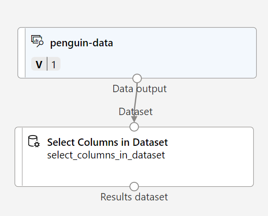
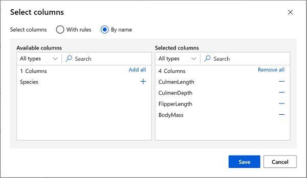
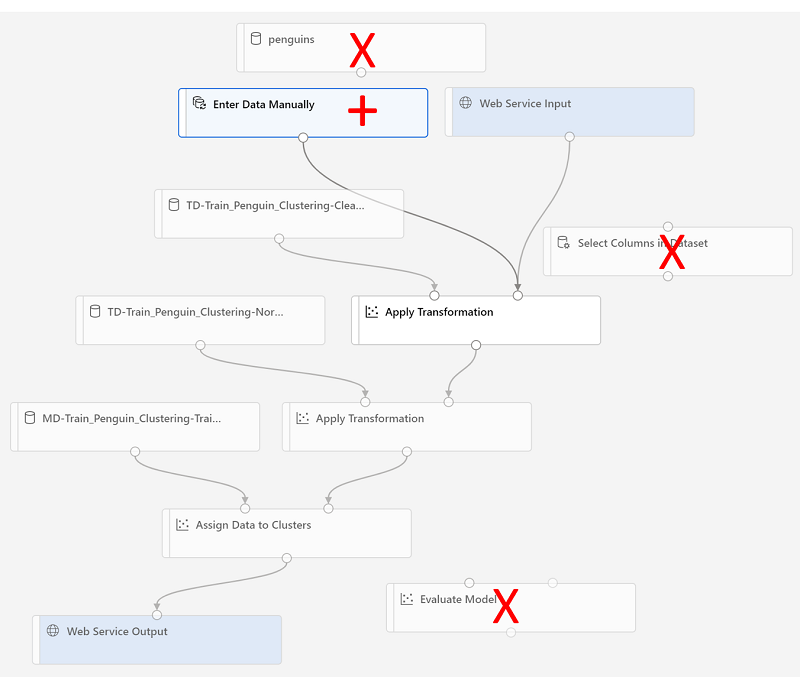

---
lab:
  title: Explorer le clustering avec le concepteur Azure Machine Learning
---

# Explorer le clustering avec le concepteur Azure Machine Learning

> **Remarque** Pour suivre ce labo, vous avez besoin d’un [abonnement Azure](https://azure.microsoft.com/free?azure-portal=true) dans lequel vous disposez d’un accès administratif.

## Création d’un espace de travail Microsoft Azure Machine Learning  

1. Connectez-vous au [portail Azure](https://portal.azure.com?azure-portal=true) en utilisant vos informations d’identification Microsoft.

1. Sélectionnez **+ Créer une ressource**, recherchez *Machine Learning*, puis créez une ressource **Azure Machine Learning** avec un plan *Azure Machine Learning*. Utilisez les paramètres suivants :
    - **Abonnement** : *votre abonnement Azure*.
    - **Groupe de ressources** : *créez ou sélectionnez un groupe de ressources*.
    - **Nom de l’espace de travail** : *entrez un nom unique pour votre espace de travail*.
    - **Région** : *sélectionnez la région géographique la plus proche*.
    - **Compte de stockage** : *notez le nouveau compte de stockage par défaut à créer pour votre espace de travail*.
    - **Coffre de clés** : *notez le nouveau coffre de clés par défaut, qui va être créé pour votre espace de travail*.
    - **Application Insights** : *notez la nouvelle ressource Application Insights par défaut, qui va être créée pour votre espace de travail*.
    - **Registre de conteneurs** : aucun (*un registre est créé automatiquement la première fois que vous déployez un modèle sur un conteneur*)

1. Sélectionnez **Vérifier + créer**, puis sélectionnez **Créer**. Attendez que votre espace de travail soit créé (cela peut prendre quelques minutes), puis accédez à la ressource déployée.

1. Sélectionnez **Lancer Studio** (ou ouvrez un nouvel onglet de navigateur, accédez à [https://ml.azure.com](https://ml.azure.com?azure-portal=true), puis connectez-vous à Azure Machine Learning Studio à l’aide de votre compte Microsoft).

1. Dans Azure Machine Learning Studio, vous devez voir l’espace de travail qui vient d’être créé. Si ce n’est pas le cas, sélectionnez votre annuaire Azure dans le menu de gauche. Ensuite, dans le nouveau menu de gauche, sélectionnez **Espaces de travail**, où tous les espaces de travail associés à votre annuaire sont listés, puis sélectionnez celui que vous avez créé pour cet exercice.

> **Remarque** Ce module fait partie de l’un des nombreux modules qui utilisent un espace de travail Azure Machine Learning, tout comme les autres modules du parcours d’apprentissage [Microsoft Azure AI - Notions fondamentales : Explorer les outils visuels pour le machine learning](https://docs.microsoft.com/learn/paths/create-no-code-predictive-models-azure-machine-learning/). Si vous utilisez votre propre abonnement Azure, vous pouvez éventuellement créer l’espace de travail une seule fois et le réutiliser dans d’autres modules. Une petite quantité de stockage de données est facturée dans votre abonnement Azure tant que l’espace de travail Azure Machine Learning existe dans votre abonnement. Nous vous recommandons donc de supprimer cet espace de travail dès qu’il n’est plus nécessaire.

## Créer une capacité de calcul

1. Dans [Azure Machine Learning studio](https://ml.azure.com?azure-portal=true), sélectionnez l’icône **&#8801;** (une icône de menu qui figure un empilement de trois lignes) à gauche pour voir les différentes pages de l’interface (il peut être nécessaire d’agrandir au maximum la taille de votre écran). Vous pouvez utiliser ces pages du volet de gauche pour gérer les ressources dans votre espace de travail. Sélectionnez la page **Calcul** (sous **Gérer**).

2. Dans la page **Calcul**, sélectionnez l’onglet **Clusters de calcul**, puis ajoutez un nouveau cluster de calcul avec les paramètres suivants. Vous l’utiliserez pour entraîner un modèle Machine Learning :
    - **Localisation** : *Sélectionnez la même localisation que celle de votre espace de travail. Si cette localisation n’est pas listée, choisissez celle qui est la plus proche de vous*.
    - **Niveau de machine virtuelle** : dédié
    - **Type de machine virtuelle** : Processeur
    - **Taille de machine virtuelle** :
        - Choisir **Sélectionner parmi toutes les options**
        - Rechercher et sélectionner **Standard_DS11_v2**
    - Sélectionnez **Suivant**.
    - **Nom de la capacité de calcul** : *entrez un nom unique*.
    - **Nombre minimal de nœuds** : 0
    - **Nombre maximal de nœuds** : 2
    - **Secondes d’inactivité avant le scale-down** : 120
    - **Activer l’accès SSH** : ne pas cocher
    - Sélectionnez **Créer**

> **Remarque** Les clusters et les instances de calcul sont basés sur des images de machines virtuelles Azure standard. Pour ce module, l’image *Standard_DS11_v2* est recommandée pour obtenir un équilibre optimal entre coûts et performances. Si votre abonnement s’accompagne d’un quota qui ne couvre pas cette image, choisissez-en une autre. Gardez cependant à l’esprit qu’une image plus grande peut entraîner des coûts plus élevés, tandis qu’une plus petite risque de ne pas suffire pour effectuer les tâches. Vous pouvez également demander à votre administrateur Azure d’étendre votre quota.

La création du cluster de calcul prend du temps. Vous pouvez passer à l’étape suivante en attendant.

## Créer un pipeline et ajouter un jeu de données

Pour commencer à utiliser un concepteur Azure Machine Learning, vous devez d’abord créer un pipeline.

1. Dans [Azure Machine Learning studio](https://ml.azure.com?azure-portal=true), développez le volet gauche en sélectionnant l’icône de menu en haut à gauche de l’écran. Affichez la page **Concepteur** (sous **Création**), puis sélectionnez **+** pour créer un pipeline.

1. Modifiez le nom du brouillon (**Pipeline-Created-on-* date***) par **Entraîner un clustering Penguin**.

    Dans Azure Machine Learning, les données utilisées pour l’entraînement de modèle et d’autres opérations sont généralement encapsulées dans un objet appelé *jeu de données*. Dans ce module, vous utilisez un jeu de données qui contient des observations pourtant sur trois espèces de manchots.

1. Affichez la page **Données** (sous **Ressources**). La page Données contient des tables ou des fichiers de données spécifiques que vous prévoyez d’utiliser dans Azure Machine Learning.

1. Dans la page **Données**, sous l’onglet **Ressources de données**, sélectionnez **+ Créer**. Configurez ensuite une ressource de données avec les paramètres suivants :
    - **Type de données** :
        - **Nom** : penguin-data
        - **Description** : Données sur les manchots
        - **Type de jeu de données** : Tabulaire
    - **Source de données** : fichiers web
    - **URL web** :
        - **URL web** : https://aka.ms/penguin-data
        - **Ignorer la validation des données** : *ne pas sélectionner*
    - **Paramètres**:
        - **Format de fichier** : Délimité
        - **Délimiteur** : Virgule
        - **Encodage** : UTF-8
        - **En-têtes de colonnes** : seul le premier fichier comporte des en-têtes
        - **Ignorer les lignes** : Aucune
        - **Le jeu de données contient des données à plusieurs lignes** : *ne les sélectionnez pas*
    - **Schéma** :
        - Inclure toutes les colonnes autres que **Chemin**
        - Examiner les types détectés automatiquement
    - **Révision**
        - Sélectionnez **Créer**

1. Une fois que vous avez créé le jeu de données, ouvrez-le, puis affichez la page **Explorer** pour voir un échantillon des données. Ces données sont des mesures tirées de multiples observations des manchots : longueur et épaisseur du culmen (bec), longueur des ailes et masse corporelle. Trois espèces de manchots sont représentées dans le jeu de données : *Adélie*, *Papou* et *À jugulaire*.

> **Remarque** Le jeu de données sur les manchots utilisé dans cet exercice est un sous-ensemble des données collectées et mises à disposition par le [Dr Kristen Gorman](https://www.uaf.edu/cfos/people/faculty/detail/kristen-gorman.php) et la [station Palmer, en Antarctique](https://pal.lternet.edu/), qui fait partie du [réseau mondial de recherche écologique à long terme (LTER)](https://lternet.edu/).

### Charger les données sur le canevas

1. Revenez à votre pipeline en sélectionnant **Concepteur** dans le menu de gauche. Dans la page **Designer**, sélectionnez le brouillon de pipeline **Entraîner un clustering Penguin**.

1. À côté du nom du pipeline situé à gauche, sélectionnez l’icône en forme de flèche pour développer le panneau, s’il ne l’est pas déjà. Le panneau doit s’ouvrir par défaut sur le volet **Bibliothèque de ressources**, indiqué par l’icône de livres en haut du panneau. Notez qu’il existe une barre de recherche pour localiser les ressources. Notez deux boutons : **Données** et **Composant**.

    

1. Sélectionnez **Données**, recherchez et placez le jeu de données **penguin-data** sur le canevas.

1. Cliquez avec le bouton droit (Ctrl+clic sur un Mac) sur le jeu de données **penguin-data** dans le canevas et cliquez sur **Preview data** (Aperçu des données).

1. Sélectionnez l’onglet *Profil*. Vous pouvez afficher les distributions des différentes colonnes sous forme d’histogrammes.

1. Le jeu de données présente les caractéristiques suivantes :

    - Le jeu de données comprend les colonnes suivantes :
        - **CulmenLength** : longueur du bec du manchot, en millimètres.
        - **CulmenDepth** : profondeur du bec du manchot, en millimètres.
        - **FlipperLength** : longueur des ailes du manchot, en millimètres.
        - **BodyMass** : poids du manchot, en grammes.
        - **Species** : indicateur d’espèce (0 : « Adélie », 1 : « Papou », 2 : « À jugulaire »)
    - Il y a deux valeurs manquantes dans la colonne **CulmenLength** (les colonnes **CulmenDepth**, **FlipperLength** et **BodyMass** ont elles aussi deux valeurs manquantes).
    - Les valeurs de mesure sont sur des échelles différentes (de quelques dizaines de millimètres à des milliers de grammes).

1. Fermez la page **DataOutput** pour voir le jeu de données sur le canevas du pipeline.

## Appliquer des transformations

1. Dans le volet **Bibliothèque de ressources** sur la gauche, sélectionnez **Composants** (qui contiennent un large éventail de modules pour la transformation des données et l’entraînement du modèle). Vous pouvez aussi utiliser la barre de recherche pour localiser rapidement les modules.

    

1. Pour regrouper les observations sur les manchots, nous utiliserons uniquement les mesures, sans prendre en compte la colonne de l’espèce. Recherchez le module **Sélectionner des colonnes du jeu de données** et placez-le sur le canevas, sous le module **penguin-data**, puis connectez la sortie en bas du module **penguin-data** à l’entrée en haut du module **Sélectionner des colonnes du jeu de données**, de la façon suivante :

    

1. Double-cliquez sur le module **Sélectionner des colonnes du jeu de données**, puis dans le volet à droite, sélectionnez **Modifier la colonne**. Ensuite, dans la fenêtre **Select columns**, sélectionnez **By name** et utilisez les liens **+** pour sélectionner les noms de colonnes **CulmenLength**, **CulmenDepth**, **FlipperLength** et **BodyMass**, de cette manière :

    

1. Sélectionnez **Enregistrer**, puis fermez le menu **Sélectionner des colonnes du jeu de données** pour revenir au canevas du concepteur.

1. Dans la **Bibliothèque de composants**, recherchez un module **Nettoyer les données manquantes** et placez-le sur le canevas, sous le module **Sélectionner des colonnes du jeu de données**, puis connectez-les de la façon suivante :

    

1. Doublez-cliquez sur le module **Nettoyer les données manquantes**, puis, dans le volet des paramètres à droite, cliquez sur **Modifier la colonne**. Puis, dans la fenêtre **Colonnes à nettoyer**, sélectionnez **Avec règles**, et incluez **Toutes les colonnes**, comme ceci :

    

1. Sélectionnez **Enregistrer**, puis, dans le volet Paramètres, définissez les paramètres de configuration suivants :
    - **Minimum missing value ratio** : 0.0
    - **Maximum missing value ratio** : 1.0
    - **Cleaning mode** : Remove entire row

1. Dans la **Bibliothèque de composants**, recherchez un module **Normaliser les données** et placez-le sur le canevas, sous le module **Nettoyer les données manquantes**. Ensuite, connectez la sortie la plus à gauche du module **Clean Missing Data** à l’entrée du module **Normalize Data**.

    

1. Double-cliquez sur le module **Normaliser les données**, puis dans le volet à droite, définissez **Méthode de transformation** sur **MinMax** et sélectionnez **Modifier la colonne**. Dans la fenêtre **Colonnes à transformer**, sélectionnez ensuite **Avec règles**, et incluez **Toutes les colonnes**, comme ceci :

    

1. Sélectionnez **Enregistrer**, puis fermez les paramètres du module **Normaliser les données** pour revenir au canevas du concepteur.

## Exécuter le pipeline

Pour appliquer vos transformations de données, vous devez exécuter le pipeline en tant qu’expérience.

1. Sélectionnez **Configurer & soumettre** en haut de la page pour ouvrir la boîte de dialogue **Configurer la tâche de pipeline**.

1. Dans la page **Informations de base**, sélectionnez **Créer** et définissez le nom de l’expérience sur **mslearn-penguin-training**, puis sélectionnez **Suivant**.

1. Dans la page **Entrées & sorties**, sélectionnez **Suivant** sans apporter de modifications.

1. Une erreur s’affiche dans la page **Paramètres d’exécution**, car vous n’avez pas de calcul par défaut pour exécuter le pipeline. Dans la liste déroulante **Sélectionner un type de calcul**, sélectionnez *Cluster de calcul* et, dans la liste déroulante **Sélectionner un cluster de calcul Azure ML**, sélectionnez votre cluster de calcul récemment créé.

1. Sélectionnez **Suivant** pour examiner le travail de pipeline, puis **Envoyer** pour exécuter le pipeline d’entraînement.

1. Attendez la fin de l’exécution. L’opération peut prendre 5 minutes ou plus. Vous pouvez vérifier l’état du travail en sélectionnant **Travaux** sous **Ressources**. À partir de là, sélectionnez le travail **Entraîner un clustering Penguin**.


## Afficher les données transformées

1. Une fois l’exécution terminée, les modules vont ressembler à ceci :

    

1. Cliquez avec le bouton droit sur le module **Normaliser les données**, sélectionnez **Aperçu des données**, puis **Jeu de données transformé** pour afficher les résultats.

1. Observez les données. Vous voyez que la colonne **Species** a été supprimée, qu’il ne manque aucune valeur et que les valeurs des quatre caractéristiques ont été normalisées à une échelle commune.

1. Fermez la page **Transformed_dataset** pour revenir à l’exécution du pipeline.

Maintenant que vous avez sélectionné et préparé les caractéristiques du jeu de données que vous souhaitez utiliser, vous pouvez vous en servir pour entraîner un modèle de clustering.

Après avoir utilisé des transformations de données pour préparer les données, vous pouvez vous en servir pour entraîner un modèle Machine Learning.

## Ajouter des modules d’entraînement

Suivez les étapes suivantes pour étendre le pipeline **Train Penguin Clustering**, comme illustré ici :


Effectuez les étapes suivantes en utilisant l’image ci-dessus pour référence quand vous ajoutez et configurez les modules requis.

1. Revenez à la page **Designer** et ouvrez le brouillon de pipeline **Entraîner un clustering Penguin**.

1. Dans le volet **Bibliothèque de ressources** sur la gauche, recherchez et placez un module **Découper les données** sur le canevas, sous le module **Normaliser les données**. Connectez ensuite la sortie à gauche du module **Normalize Data** à l’entrée du module **Split Data**.

    >**Conseil** Utilisez la barre de recherche pour localiser rapidement les modules.

1. Sélectionnez le module **Split Data** et configurez ses paramètres comme suit :
    - **Splitting mode** : Split Rows
    - **Fraction of rows in the first output dataset** : 0.7
    - **Fractionnement aléatoire** : True
    - **Random seed** : 123
    - **Stratified split** : False

1. Dans la **Bibliothèque de composants**, recherchez et placez un module **Entraîner le modèle de clustering** sur le canevas, sous le module **Découper les données**. Connectez ensuite la sortie de *Jeu de données1 de résultats* (à gauche) du module **Découper les données** à l’entrée de *Jeu de données* (à droite) du module **Entraîner le modèle de clustering**.

1. Le modèle de clustering doit affecter des clusters aux éléments de données en prenant en compte toutes les caractéristiques que vous avez sélectionnées dans le jeu de données d’origine. Double-cliquez sur le module **Entraîner le modèle de clustering**, puis dans le volet droit, sélectionnez **Modifier la colonne**. Utilisez l’option **Avec des règles** pour inclure toutes les colonnes, comme suit :

    

1. Le modèle que nous sommes en train d’entraîner utilisera les caractéristiques pour regrouper les données en clusters. Nous devons donc entraîner le modèle au moyen d’un algorithme de *clustering*. Dans la **Bibliothèque de composants**, recherchez et placez un module **Clustering k-moyennes** sur le canevas, à gauche du module **Fractionner des données** et au-dessus du module **Entraîner le modèle de clustering**. Ensuite, connectez sa sortie à l’entrée **Untrained model** (à gauche) du module **Train Clustering Model**.

1. L’algorithme *k-moyennes* regroupe les éléments selon le nombre de clusters que vous spécifiez, représenté par la valeur ***K***. Sélectionnez le module **Clustering k-moyennes**, puis dans le volet de droite, définissez le paramètre **Nombre de centroïdes** sur **3**.

    > **Remarque** Vous pouvez considérer les observations de données, par exemple les mesures des manchots, comme des vecteurs multidimensionnels. L’algorithme K-Means fonctionne de la façon suivante :
    > 1. Il initialise des coordonnées *K* en tant que points sélectionnés de manière aléatoire, les *centroïdes*, dans un espace à *N* dimensions (où *N* est le nombre de dimensions dans les vecteurs de caractéristiques).
    > 2. Il trace les vecteurs de caractéristiques sous forme de points dans le même espace et il affecte chaque point à son centroïde le plus proche.
    > 3. Il déplace les centroïdes au milieu des points qui lui sont affectés (en fonction de la distance *moyenne*).
    > 4. Il réaffecte les points à leur centroïde le plus proche après le déplacement.
    > 5. Répétition des étapes c. et D. Jusqu’à la stabilisation des allocations du cluster ou l’achèvement du nombre spécifié d’itérations.

   Après avoir utilisé 70 % des données dans le cadre de l’entraînement du modèle de clustering, vous pouvez utiliser les 30 % restants afin de le tester en utilisant le modèle pour affecter les données aux clusters.

1. Dans la **Bibliothèque de composants**, recherchez et placez un module **Affecter des données aux clusters** sur le canevas, sous le module **Entraîner le modèle de clustering**. Ensuite, connectez la sortie **Trained model** (à gauche) du module **Train Clustering Model** à l’entrée **Trained model** (à gauche) du module **Assign Data to Clusters**, et connectez la sortie **Results dataset2** (à droite) du module **Split Data** à l’entrée **Dataset** (à droite) du module **Assign Data to Clusters**.

## Exécuter le pipeline d’entraînement

Vous êtes maintenant prêt à exécuter le pipeline d’entraînement et à entraîner le modèle.

1. Vérifiez que votre pipeline ressemble à ceci :

    

1. Sélectionnez **Configurer & soumettre**, puis exécutez le pipeline l’expérience existante nommée **mslearn-penguin-training** sur votre cluster de calcul.

1. Attendez la fin de l’exécution. L’opération peut prendre 5 minutes ou plus. Vérifiez l’état du travail en sélectionnant **Travaux** sous **Ressources**. À partir de là, sélectionnez la dernière tâche **Entraîner un clustering Penguin**.

1. Lorsque l’exécution de l’expérience s’achève, cliquez avec le bouton droit sur le module **Attribuer des données à des clusters**, sélectionnez **Aperçu des données**, puis sélectionnez **Jeu de données de résultats** pour afficher les résultats.

1. Faites défiler vers le bas afin de voir la colonne **Affectations**, qui contient le cluster (0, 1 ou 2) auquel chaque ligne est affectée. Vous voyez aussi de nouvelles colonnes qui indiquent la distance entre le point représentant cette ligne et les centres de chacun des clusters ; le point est affecté au cluster qui se trouve le plus près de lui.

1. Fermez la visualisation **Results_dataset** pour revenir à l’exécution du pipeline.

Le modèle prédit les clusters pour les observations sur les manchots, mais ses prédictions sont-elles fiables ? Pour le déterminer, vous devez évaluer le modèle.

L’évaluation d’un modèle de clustering est rendue difficile par le fait qu’il n’existe pas de valeurs *vrai* déjà connues pour les affectations de cluster. Un modèle de clustering performant est un modèle qui atteint un bon niveau de séparation entre les éléments dans chaque cluster. Nous avons donc besoin de métriques qui nous aident à mesurer cette séparation.

## Ajouter un module Evaluate Model

1. Dans la page **Designer**, ouvrez le brouillon de pipeline **Entraîner un clustering Penguin**.

1. Dans la **Bibliothèque de ressources**, recherchez et placez un module **Évaluer le modèle** sur le canevas, sous le module **Affecter des données aux clusters**. Connectez la sortie du module **Affecter des données aux clusters** à l’entrée (gauche) **Jeu de données scoré** du module **Évaluer le modèle**.

1. Vérifiez que votre pipeline ressemble à ceci :

    

1. Sélectionnez **Configurer & soumettre**, puis exécutez le pipeline l’expérience existante nommée **mslearn-penguin-training** sur votre cluster de calcul.

1. Attendez la fin de l’exécution de l’expérience. Pour vérifier son état, accédez à la page **Travaux** et sélectionnez la dernière tâche **Entraîner un clustering Pingouin**.

1. Cliquez avec le bouton droit sur le module **Évaluer le modèle**, sélectionnez **Aperçu des données**, puis **Résultats de l’évaluation**. Examinez les métriques de chaque ligne :
    - **Average Distance to Other Center**
    - **Average Distance to Cluster Center**
    - **Number of Points**
    - **Maximal Distance to Cluster Center**

1. Fermez l’onglet **Résultats de l’évaluation**.

Maintenant que vous disposez d’un modèle de clustering opérationnel, vous pouvez l’utiliser pour affecter de nouvelles données aux clusters dans un *pipeline d’inférence*.

Après avoir créé et exécuté un pipeline pour entraîner le modèle, vous pouvez créer un *pipeline d’inférence*. Le pipeline d’inférence utilise le modèle pour affecter de nouvelles observations de données aux clusters. Ce modèle va constituer la base d’un service prédictif que vous pouvez publier en vue de son utilisation par des applications.

## Créer un pipeline d'inférence

1. Accédez au menu au-dessus du canevas, puis sélectionnez **Créer un pipeline d’inférence**. Il peut être nécessaire de passer en mode plein écran et de cliquer sur l’icône **...** en haut à droite de l’écran pour trouver **Créer un pipeline d’inférence** dans le menu.  

    

1. Dans la liste déroulante **Créer un pipeline d’inférence**, cliquez sur **Pipeline d’inférence en temps réel**. Après quelques secondes, une nouvelle version de votre pipeline nommé **Train Penguin Clustering-real time inference** s’ouvre.

1. Renommez le nouveau pipeline en **Predict Penguin Clusters**, puis examinez le nouveau pipeline. Les transformations et le modèle de clustering de votre pipeline d’entraînement font partie de ce pipeline. Le modèle entraîné sera utilisé pour attribuer un score aux nouvelles données. Le pipeline contient également une sortie de service web pour retourner les résultats.

    Vous allez apporter les modifications suivantes au pipeline d’inférence :

    

    - Ajoutez un composant **Entrée du service web** pour permettre l’envoi des nouvelles données.
    - Remplacez le jeu de données **penguin-data** par un composant **Entrer des données manuellement** qui n’inclut pas la colonne **Species**.
    - Supprimez le composant **Sélectionner des colonnes dans le jeu de données**, qui est maintenant redondant.
    - Connectez les composants **Entrée du service web** et **Entrer des données manuellement** (qui représentent les entrées de données à mettre en cluster) au premier composant **Appliquer une transformation**.

    Suivez les étapes restantes ci-dessous, en utilisant l’image et les informations ci-dessus à titre de référence quand vous modifiez le pipeline.

1. Le pipeline n’inclut pas automatiquement de composant **Entrée du service web** pour les modèles créés à partir de jeux de données personnalisés. Recherchez un composant **Entrée du service web** dans la bibliothèque de ressources, puis placez-le en haut du pipeline.  Connectez la sortie du composant **Entrée du service web** à l’entrée *Dataset* (droite) du premier composant **Appliquer une transformation** qui se trouve déjà sur le canevas.  

1. Le pipeline d’inférence part du principe que les nouvelles données correspondent au schéma des données d’entraînement d’origine ; le jeu de données **penguin-data** du pipeline d’entraînement est donc inclus. Toutefois, ces données d’entrée comportent une colonne pour l’espèce de manchot, que le modèle n’utilise pas. Supprimez le jeu de données **penguin-data** ainsi que les modules **Select Columns in Dataset**, et remplacez-les par un module **Enter Data Manually** de la **Bibliothèque de composants**.

1. Modifiez ensuite les paramètres du module **Enter Data Manually** pour utiliser l’entrée CSV suivante, qui contient les valeurs des caractéristiques de trois nouvelles observations de manchots (avec les en-têtes) :

    ```CSV
    CulmenLength,CulmenDepth,FlipperLength,BodyMass
    39.1,18.7,181,3750
    49.1,14.8,220,5150
    46.6,17.8,193,3800
    ```

1. Connectez les sorties du module **Entrer des données manuellement** à l’entrée *Dataset* (à droite) du premier module **Appliquer la transformation**.

1. Supprimez le module **Evaluate Model**.

1. Vérifiez que votre pipeline est similaire à l’image suivante :

    

1. Soumettez le pipeline en tant que nouvelle expérience nommée **mslearn-penguin-inference** sur votre cluster de calcul. L’expérience peut prendre un certain temps.

1. Accédez à **Travaux** et sélectionnez la dernière tâche **Prédire les clusters Penguin** avec le nom de l’expérience **mslearn-penguin-inference**.

1. Lorsque votre pipeline est terminé, cliquez avec le bouton droit sur le module **Affecter des données aux clusters**, sélectionnez **Aperçu des données**, puis **Jeu de données de résultats** afin de voir les métriques et les affectations de clusters prédites pour les trois observations de manchots dans les données d’entrée.

Votre pipeline d’inférence affecte les observations de manchots aux clusters en fonction de leurs caractéristiques. Vous êtes maintenant prêt à publier le pipeline afin que les applications clientes puissent l’utiliser.

## Déployer un service

Dans cet exercice, vous déployez le service web sur une instance de conteneur Azure (ACI). Ce type de calcul, créé dynamiquement, est utile pour le développement et le test. Pour la production, vous devez créer un *cluster d’inférence* qui fournit un cluster Azure Kubernetes Service (AKS) offrant une meilleure scalabilité et une meilleure sécurité.

1. Dans la page d’exécution de l’inférence **Prédire les clusters Penguin**, sélectionnez **Déployer** dans la barre de menus supérieure.

    

1. Sélectionnez **Déployer un nouveau point de terminaison en temps réel** et utilisez les paramètres suivants :
    - **Nom** : predict-penguin-clusters
    - **Description** : Manchots du cluster.
    - **Type de capacité de calcul** : Instance de conteneur Azure

1. Attendez que le service web soit déployé, ce qui peut prendre plusieurs minutes. 

1. Pour voir l’état du déploiement, développez le volet gauche en sélectionnant l’icône de menu en haut à gauche de l’écran. Affichez la page **Points de terminaison** (sous **Ressources**), puis sélectionnez **predict-penguin-clusters**. À la fin du déploiement, l’**État du déploiement** passe à **Sain**.

## Testez le service

1. Dans la page **Points de terminaison**, ouvrez le point de terminaison en temps réel **predict-penguin-clusters**, puis sélectionnez l’onglet **Test**.

    

1. Nous allons l’utiliser pour tester notre modèle avec de nouvelles données. Supprimez les données actuelles sous **Données d’entrée pour tester le point de terminaison en temps réel**. Copiez et collez les données ci-dessous dans la section Données :

    ```JSON
    {
        "Inputs": {
            "input1": [
                {
                    "CulmenLength": 49.1,
                    "CulmenDepth": 4.8,
                    "FlipperLength": 1220,
                    "BodyMass": 5150
                }
            ]
        },
        "GlobalParameters":  {}
    }
    ```

    > **Remarque** Le code JSON ci-dessus définit les caractéristiques d’un manchot, et utilise le service **predict-penguin-clusters** que vous avez créé pour prédire une affectation de cluster.

1. Sélectionnez **Test**. Sur la droite de l’écran, vous devez voir la sortie **« Assignments »** . Notez que le cluster affecté est celui avec la distance la plus courte au centre de cluster.

    

Vous venez de tester un service prêt à être connecté à une application cliente à l’aide des informations d’identification de l’onglet **Consommer**. Nous allons terminer le labo ici. Nous vous invitons à poursuivre votre expérimentation avec le service que vous venez de déployer.

## Nettoyage

Le service web que vous avez créé est hébergé dans une *instance de conteneur Azure*. Si vous n’envisagez pas d’effectuer d’autres expériences avec celui-ci, vous devez supprimer le point de terminaison afin d’éviter une utilisation d’Azure non nécessaire. Vous devez aussi supprimer le cluster de calcul.

1. Dans [Azure Machine Learning studio](https://ml.azure.com?azure-portal=true), sélectionnez le point de terminaison **predict-penguin-clusters** dans l’onglet **Points de terminaison**. Sélectionnez ensuite **Supprimer** (&#128465;) et confirmez que vous souhaitez supprimer le point de terminaison.

1. Dans la page **Calcul**, sous l’onglet **Clusters de calcul**, sélectionnez votre cluster de calcul, puis sélectionnez **Supprimer**.

>**Remarque** La suppression du calcul fait que votre abonnement ne sera pas facturé pour les ressources de calcul. Une petite quantité de stockage de données vous est cependant facturée tant que l’espace de travail Azure Machine Learning existe dans votre abonnement. Si vous avez terminé l’exploration d’Azure Machine Learning, vous pouvez supprimer l’espace de travail Azure Machine Learning et les ressources associées. Toutefois, si vous envisagez de suivre d’autres labos de cette série, vous devrez le recréer.
>
> Pour supprimer votre espace de travail, procédez comme suit :
>
> 1. Dans le [portail Azure](https://portal.azure.com?azure-portal=true), dans la page **Groupes de ressources**, ouvrez le groupe de ressources que vous avez spécifié lors de la création de votre espace de travail Azure Machine Learning.
> 1. Cliquez sur **Supprimer le groupe de ressources**, tapez le nom du groupe de ressources pour confirmer que vous souhaitez le supprimer, puis sélectionnez **Supprimer**.
