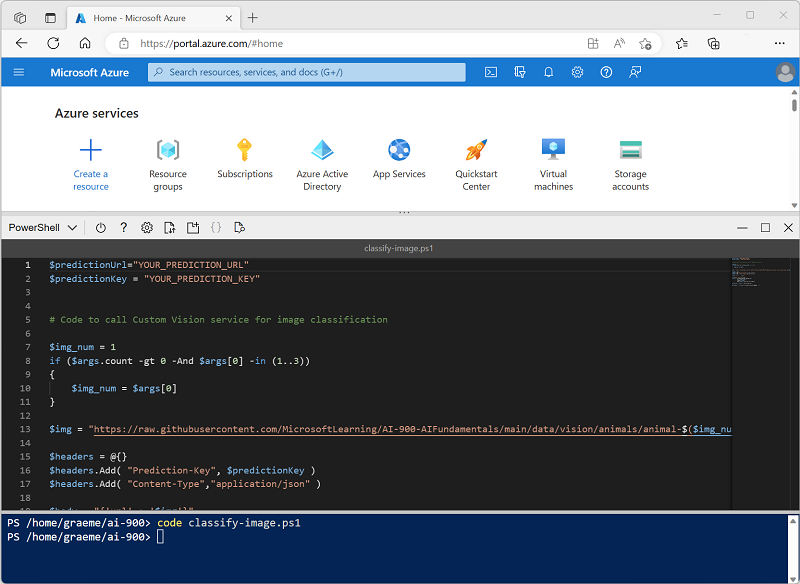

---
lab:
  title: Explorer la classification d’images
---

# Explorer la classification d’images

Le service cognitif *Vision par ordinateur* fournit des modèles prédéfinis utiles pour travailler avec les images, mais vous devrez souvent former votre propre modèle pour la vision par ordinateur. Par exemple, supposons qu’une organisation de protection de la nature souhaite suivre les observations d’animaux en utilisant des caméras sensibles au mouvement. Les images capturées par les caméras pourraient ensuite être utilisées pour vérifier la présence d’espèces particulières dans une zone particulière, et contribuer aux efforts de protection des espèces menacées. Pour ce faire, l’organisation tirerait parti d’un modèle de *classification d’images* entraîné pour identifier différentes espèces d’animaux dans les photographies capturées.

Dans Azure, vous pouvez utiliser le service cognitif ***Custom Vision*** pour former un modèle de classification d’images à partir d’images existantes. Il existe deux éléments pour créer une solution de classification d’images. Tout d’abord, vous devez former un modèle pour reconnaître des classes différentes à l’aide d’images existantes. Ensuite, lorsque le modèle est formé, vous devez le publier en tant que service qui peut être consommé par des applications.

Pour tester les fonctionnalités du service Custom Vision, nous allons utiliser une simple application en ligne de commande s’exécutant dans le service Cloud Shell. Les mêmes principes et fonctionnalités s’appliquent dans les solutions réelles, comme des sites web ou des applications mobiles.

## Avant de commencer

Pour terminer ce labo, vous aurez besoin d’un [abonnement Azure](https://azure.microsoft.com/free?azure-portal=true) dans lequel vous disposez d’un accès administratif.

## Créer une ressource *Cognitive Services*

Vous pouvez utiliser le service Custom Vision en créant une ressource **Custom Vision** ou **Cognitive Services** .

>**Remarque** Toutes les ressources ne sont pas disponibles dans toutes les régions. Que la ressource à créer soit une ressource Custom Vision ou Cognitive Services, seules les ressources créées dans [certaines régions](https://azure.microsoft.com/global-infrastructure/services/?products=cognitive-services) peuvent être utilisées pour accéder aux services Custom Vision. Par souci de simplicité, une région est présélectionnée pour vous dans les instructions de configuration ci-dessous.

Créez une ressource **Cognitive Services** dans votre abonnement Azure.

1. Ouvrez le portail Azure sur [https://portal.azure.com](https://portal.azure.com?azure-portal=true) en vous connectant avec votre compte Microsoft.

1. Cliquez sur le bouton **&#65291;Créer une ressource**, recherchez *Cognitive Services*, puis créez une ressource **Cognitive Services** avec les paramètres suivants :
    - **Abonnement** : *votre abonnement Azure*.
    - **Groupe de ressources** : *sélectionnez ou créez un groupe de ressources portant un nom unique*.
    - **Région** : USA Est
    - **Nom** : *entrez un nom unique.*
    - **Niveau tarifaire** : Standard S0
    - **En cochant cette case, j’ai reconnu que j’ai lu et compris tous les termes ci-dessous** : sélectionné.

1. Examinez et créez la ressource, puis attendez la fin du déploiement. Accédez ensuite à la ressource déployée.

1. Affichez la page **Clés et point de terminaison** de votre ressource Cognitive Services. Vous aurez besoin du point de terminaison et des clés pour vous connecter à partir d’applications clientes.

## Créer un projet Custom Vision

Pour former un modèle de détection d’objets, vous devez créer un projet Custom Vision basé sur votre ressource de formation. Pour ce faire, vous allez utiliser le portail Custom Vision.

1. Téléchargez et extrayez les images d’entraînement depuis [https://aka.ms/animal-images](https://aka.ms/animal-images). Ces images sont fournies dans un dossier compressé, qui, quand il est extrait, contient des sous-dossiers appelés **elephant**, **giraffe** et **lion**.

1. Ouvrez un nouvel onglet de navigateur et accédez au portail Custom Vision à l’adresse [https://customvision.ai](https://customvision.ai?azure-portal=true). Si vous y êtes invité, connectez-vous en utilisant le compte Microsoft associé à votre abonnement Azure et acceptez les conditions de service.

1. Dans le portail Custom Vision, créez un nouveau projet avec les paramètres suivants :

    - **Nom** : identification de l’animal
    - **Description** : classification d’images pour des animaux
    - **Ressource** : *la ressource Custom Vision que vous avez créée précédemment*
    - **Types de projets** : Classification
    - **Types de classification** : multiclasse (une seule étiquette par image)
    - **Domaines** : Général\[A2]

1. Cliquez sur **Ajouter des images**, puis sélectionnez tous les fichiers du dossier **elephant** que vous avez extrait précédemment. Chargez ensuite les fichiers image en spécifiant l’étiquette *éléphant*, comme suit :

    

1. Utilisez le bouton **Ajouter des images** ([+]) pour charger les images dans le dossier **giraffe** avec l’étiquette *girafe*, et les images dans le dossier **lion** avec l’étiquette *lion*.

1. Explorez les images que vous avez chargées dans le projet Custom Vision : il doit y avoir 17 images de chaque classe, comme suit :

    

1. Dans le projet Custom Vision, au-dessus des images, cliquez sur **Former** pour former un modèle de classification à l’aide des images avec balises. Sélectionnez l’option **Entraînement rapide**, puis attendez la fin de l’itération d’entraînement.

    > **Conseil** : L’entraînement peut prendre quelques minutes. Pendant que vous attendez, consultez [Comment les selfies des léopards des neiges et l’IA peuvent aider à sauver l’espèce de l’extinction](https://news.microsoft.com/transform/snow-leopard-selfies-ai-save-species/), qui décrit un projet réel qui utilise la vision par ordinateur pour suivre les animaux en voie de disparition dans la nature.

1. Une fois la formation de l’itération de modèle terminée, examinez les métriques de performance *Précision*, *Rappel* et *AP* : elles mesurent la précision de la prédiction du modèle de classification et doivent toutes être élevées.

## Tester le modèle

Avant de publier cette itération du modèle pour que les applications puissent l’utiliser, vous devez la tester.

1. Au-dessus des métriques de performances, cliquez sur **Test rapide**.

1. Dans la zone **URL de l’image**, tapez `https://aka.ms/giraffe`, puis cliquez sur le bouton **Test rapide de l’image (&#10132;)** .

1. Visualisez les prédictions retournées par votre modèle : le score de probabilité pour *girafe* devrait être le plus élevé, comme ceci :

    

1. Fermez la fenêtre **Test rapide**.

## Publier le modèle de classification d’images

Vous êtes maintenant prêt à publier votre modèle formé et à l’utiliser à partir d’une application cliente.

1. Cliquez sur **&#128504; Publier** pour publier le modèle formé avec les paramètres suivants :
    - **Nom du modèle** : animaux
    - **Ressource de prédiction** : *la ressource de prédiction Cognitive Services ou Custom Vision que vous avez créée précédemment*.

1. Après la publication, cliquez sur l’*URL de prédiction* (&#127760;) pour afficher les informations requises afin d’utiliser le modèle publié.

    

Plus tard, vous aurez besoin de l’URL et des valeurs Prediction-Key appropriées pour obtenir une prédiction à partir d’une URL d’image. Aussi, gardez cette boîte de dialogue ouverte et poursuivez avec la tâche suivante.

## Préparer une application cliente

Pour tester les fonctionnalités du service Custom Vision, nous allons utiliser une application en ligne de commande simple qui s’exécute dans Cloud Shell sur Azure.

1. Revenez à l’onglet du navigateur contenant le portail Azure, puis sélectionnez le bouton **Cloud Shell** ( **[>_]** ) en haut de la page, à droite de la zone de recherche. Ceci ouvre un volet Cloud Shell dans le bas du portail.

    Lorsque vous ouvrez le service Cloud Shell première fois, il se peut que vous soyez invité à choisir le type d’interpréteur de commandes que vous souhaitez utiliser (*Bash* ou *PowerShell*). Si c’est le cas, sélectionnez **PowerShell**.

    Si vous êtes invité à créer un stockage pour votre Cloud Shell, vérifiez que votre abonnement est spécifié, puis sélectionnez **Créer un stockage**. Patientez ensuite environ une minute jusqu’à ce que le stockage soit créé.

    Quand Cloud Shell est prêt, il doit être similaire à ceci :
    
    

    > **Conseil** : Vérifiez que le type de shell indiqué en haut à gauche du volet Cloud Shell est *PowerShell*. S’il s’agit de *Bash*, basculez vers *PowerShell* à l’aide du menu déroulant.

    Notez que vous pouvez redimensionner le volet Cloud Shell en faisant glisser la barre de séparation en haut du volet. Vous pouvez aussi utiliser les icônes **&#8212;** , **&#9723;** et **X** situées en haut à droite du volet pour réduire, agrandir et fermer le volet. Pour plus d’informations sur l’utilisation d’Azure Cloud Shell, consultez la [documentation Azure Cloud Shell](https://docs.microsoft.com/azure/cloud-shell/overview).

2. Dans le shell de commandes, entrez les commandes suivantes pour télécharger les fichiers de cet exercice et les enregistrer dans un dossier nommé **ai-900** (après avoir supprimé ce dossier s’il existe déjà)

    ```PowerShell
    rm -r ai-900 -f
    git clone https://github.com/MicrosoftLearning/AI-900-AIFundamentals ai-900
    ```

3. Une fois les fichiers téléchargés, entrez les commandes suivantes pour accéder au répertoire **ai-900** et modifier le fichier de code pour cet exercice :

    ```PowerShell
    cd ai-900
    code classify-image.ps1
    ```

    Notez que cela a pour effet d’ouvrir un éditeur comme celui figurant dans l’image ci-dessous :

     

     > **Conseil** : Vous pouvez utiliser la barre de séparation entre la ligne de commande de Cloud Shell et l’éditeur de code pour redimensionner les volets.

4. Ne vous souciez pas trop des détails du code. L’important est qu’il commence par du code pour spécifier l’URL et la clé de prédiction pour votre modèle Custom Vision. Vous devez les mettre à jour afin que le reste du code utilise votre modèle.

    Obtenez *l’URL de prédiction* et la *clé de prédiction* dans la boîte de dialogue que vous avez laissée ouverte dans l’onglet du navigateur pour votre projet Custom Vision. **Vous avez besoin des versions à utiliser *si vous avez une URL d’image*.**

    Utilisez ces valeurs pour remplacer les espaces réservés **YOUR_PREDICTION_URL** et **YOUR_PREDICTION_KEY** dans le fichier de code.

    Après avoir collé les valeurs d’URL de prédiction et de clé de prédiction, les deux premières lignes du code doivent ressembler à ceci :

    ```PowerShell
    $predictionUrl="https..."
    $predictionKey ="1a2b3c4d5e6f7g8h9i0j...."
    ```

5. Après avoir effectué les modifications des variables dans le code, appuyez sur **Ctrl+S** pour enregistrer le fichier. Appuyez ensuite sur **Ctrl+Q** pour fermer l’éditeur de code.

## Tester l’application cliente

Vous pouvez maintenant utiliser l’exemple d’application cliente pour classifier les images en fonction de l’animal qu’elles contiennent.

1. Dans le volet PowerShell, entrez la commande suivante pour exécuter le code :

    ```PowerShell
    ./classify-image.ps1 1
    ```

    Ce code utilise votre modèle pour classifier l’image suivante :

    

1. Examinez la prédiction, qui doit être **girafe**.

1. Essayons maintenant une autre image. Exécutez cette commande :

    ```PowerShell
    ./classify-image.ps1 2
    ```

    Cette fois, l’image suivante est classifiée :

    

1. Vérifiez que le modèle classifie cette image comme **éléphant**.

1. Essayons avec une autre image. Exécutez cette commande :

    ```PowerShell
    ./classify-image.ps1 3
    ```

    L’image finale ressemble à ceci :

    

1. Vérifiez que le modèle classifie cette image comme **lion**.

Si tout va bien, votre modèle de classification d’images a correctement classifié les trois images.

## En savoir plus

Cet exercice ne montre que quelques fonctionnalités du service Custom Vision. Pour en savoir plus sur ce que ce service est capable de faire, consultez la [page Custom Vision](https://azure.microsoft.com/services/cognitive-services/custom-vision-service/).
