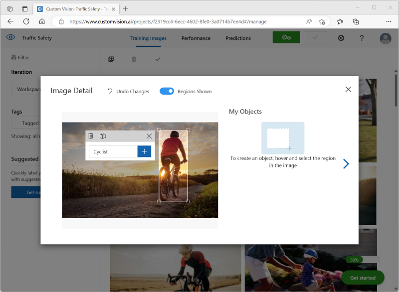

---
lab:
  title: Explorer la détection d’objet
---

# Explorer la détection d’objet

> **Remarque** Pour suivre ce labo, vous avez besoin d’un [abonnement Azure](https://azure.microsoft.com/free?azure-portal=true) dans lequel vous disposez d’un accès administratif.

La *détection d’objet* est une forme de vision informatique dans laquelle un modèle Machine Learning est formé pour classer des instances d’objet individuelles dans une image et indiquer un *rectangle englobant* qui marque son emplacement. Vous pouvez considérer cela comme une progression de la *classification d’images* (dans laquelle le modèle répond à la question « De quoi est-ce une image ? ») pour créer des solutions où nous pouvons demander au modèle « Quels objets sont sur cette image, et où ? ».

Par exemple, une initiative de sécurité routière pourrait identifier les piétons et les cyclistes comme étant les usagers de la route les plus vulnérables aux croisements du trafic. En utilisant des caméras pour surveiller les croisements, les images des usagers de la route pourraient être analysées afin de détecter les piétons et les cyclistes, afin de surveiller leurs nombres ou même pour changer le comportement des feux de circulation.

Le service **Custom Vision** dans Microsoft Azure fournit une solution basée sur le cloud pour la création et la publication de modèles de détection d’objet personnalisés. Dans Azure, vous pouvez utiliser le service Custom Vision pour entraîner un modèle de détection d’objets à partir d’images existantes. Deux éléments sont nécessaires pour créer une solution de détection d’objets. Tout d’abord, vous devez entraîner un modèle pour détecter l’emplacement et la classe des objets en utilisant des images étiquetées. Ensuite, lorsque le modèle est formé, vous devez le publier en tant que service qui peut être consommé par des applications.

Pour tester les fonctionnalités du service Custom Vision afin de détecter des objets dans des images, nous allons utiliser une simple application en ligne de commande s’exécutant dans le service Cloud Shell. Les mêmes principes et fonctionnalités s’appliquent dans les solutions réelles, comme des sites web ou des applications mobiles.

## Créer une ressource *Azure AI services*

Vous pouvez utiliser le service Custom Vision en créant une ressource **Custom Vision** ou **Azure AI services**.

> **Remarque** Toutes les ressources ne sont pas disponibles dans toutes les régions. Que la ressource à créer soit une ressource Custom Vision ou Azure AI services, seules les ressources créées dans [certaines régions](https://azure.microsoft.com/global-infrastructure/services/?products=cognitive-services) peuvent être utilisées pour accéder aux services Custom Vision. Par souci de simplicité, une région est présélectionnée pour vous dans les instructions de configuration ci-dessous.

Créez une ressource **Azure AI services** dans votre abonnement Azure.

1. Sous un autre onglet de navigateur, ouvrez le portail Azure à l’adresse [https://portal.azure.com](https://portal.azure.com?azure-portal=true) en vous connectant avec votre compte Microsoft.

1. Cliquez sur le bouton **&#65291;Créer une ressource** et recherchez *Azure AI Services*. Sélectionnez **créer** un plan **Azure AI services**. Vous accédez à une page pour créer une ressource Azure AI services. Configurez-la avec les paramètres suivants :
    - **Abonnement** : *votre abonnement Azure*.
    - **Groupe de ressources** : *sélectionnez ou créez un groupe de ressources portant un nom unique*.
    - **Région** : USA Est
    - **Nom** : *entrez un nom unique.*
    - **Niveau tarifaire** : Standard S0
    - **En cochant cette case, j’ai reconnu que j’ai lu et compris tous les termes ci-dessous** : sélectionné.

1. Examinez et créez la ressource, puis attendez la fin du déploiement. Accédez ensuite à la ressource déployée.

1. Affichez la page **Clés et points de terminaison** de votre ressource Azure AI services. Vous aurez besoin du point de terminaison et des clés pour vous connecter à partir d’applications clientes.

## Créer un projet Custom Vision

Pour former un modèle de détection d’objets, vous devez créer un projet Custom Vision basé sur votre ressource de formation. Pour ce faire, vous allez utiliser le portail Custom Vision.

1. Dans un nouvel onglet de navigateur, ouvrez le portail Custom Vision à l’adresse [https://customvision.ai](https://customvision.ai?azure-portal=true) et connectez-vous avec le compte Microsoft associé à votre abonnement Azure.

1. Créez un nouveau projet avec les paramètres suivants :
    - **Nom** : Sécurité routière
    - **Description** : Détection d’objets pour la sécurité routière.
    - **Ressource** : *La ressource que vous avez créée précédemment*
    - **Types de projets** : Détection d’objets
    - **Domaines** : Général\[A1]

1. Attendez que le projet soit créé et ouvert dans le navigateur.

## Ajouter et baliser des images

Pour former un modèle de détection d’objets, vous devez télécharger des images qui contiennent les classes que vous souhaitez que le modèle identifie, et les marquer pour qu’elles indiquent des zones englobantes pour chaque instance d’objet.

1. Téléchargez et extrayez les images d’entraînement depuis [https://aka.ms/traffic-images](https://aka.ms/traffic-images). Le dossier extrait contient une collection d’images de cyclistes et de piétons.

1. Dans le portail Custom Vision, dans votre projet de détection d’objets **Sécurité routière**, sélectionnez **Ajouter des images** et chargez toutes les images du dossier extrait.

    

1. Une fois les images téléchargées, sélectionnez la première pour l’ouvrir.

1. Maintenez la souris sur un objet (cycliste ou piéton) dans l’image jusqu’à ce qu’une zone détectée automatiquement soit affichée. Sélectionnez ensuite l’objet et, si nécessaire, redimensionnez la région pour l’entourer. Vous pouvez aussi simplement faire glisser le curseur autour de l’objet pour créer une région.

    Quand l’objet est sélectionné au plus juste dans la région rectangulaire, entrez l’étiquette appropriée pour l’objet (*Cycliste* ou *Piéton*), puis utilisez le bouton **Étiqueter la région** ( **+** ) pour ajouter l’étiquette au projet.

    

1. Utilisez le lien **Suivant** ( **(>)** situé à droite pour accéder à l’image suivante et étiqueter ses objets. Il vous suffit ensuite de continuer à travailler sur la totalité de la collection d’images, en étiquetant chaque cycliste et chaque piéton.

    Quand vous étiquetez les images, notez ce qui suit :

    - Certaines images contiennent plusieurs objets, potentiellement de types différents. Étiquetez chacun d’eux, même s’ils se recouvrent.
    - Une fois qu’une étiquette a été entrée, vous pouvez la sélectionner dans la liste lors de l’étiquetage de nouveaux objets.
    - Vous pouvez revenir en arrière et avancer dans les images pour ajuster les étiquettes.

    

1. Lorsque vous avez terminé de marquer la dernière image, fermez l’éditeur **Détails de l’image** et, dans la page **Images de formation**, sous **Balises**, sélectionnez **Avec balise** pour afficher toutes vos images avec balises :

    

## Formation et test d’un modèle

Maintenant que vous avez balisé les images de votre projet, vous pouvez former un modèle.

1. Dans le projet Custom Vision, cliquez sur **Former** pour former un modèle de détection d’objets à l’aide des images balisées. Sélectionnez l’option **Entraînement rapide**.

    > **Conseil** : L’entraînement peut prendre plusieurs minutes. En attendant, consultez [Analytique de vidéos pour les villes intelligentes](https://www.microsoft.com/research/video/video-analytics-for-smart-cities/), qui décrit un projet réel d’utilisation de la vision par ordinateur dans le cadre d’une initiative d’amélioration de la sécurité routière.

2. Attendez la fin de l’entraînement, puis passez en revue les métriques de performances *Précision*, *Rappel* et *mAP* : ces métriques mesurent la qualité de la prédiction du modèle de détection d’objets et elles doivent toutes être raisonnablement élevées.

3. Ajustez le **Seuil de probabilité** à gauche, en l’augmentant de 50 % à 90 %, et observez l’impact sur les métriques de performances. Ce paramètre détermine la valeur de la probabilité que chaque évaluation d’étiquette doit atteindre ou dépasser pour être comptabilisée comme prédiction.

    

4. En haut à droite de la page, cliquez sur **Test rapide** puis, dans la zone **URL de l’image**, entrez `https://aka.ms/pedestrian-cyclist` et regardez les résultats.

    Dans le volet de droite, sous **Prédictions**, chaque objet détecté est listé avec sa étiquette et sa probabilité. Sélectionnez chaque objet pour le voir mis en évidence dans l’image.

    Les objets prédits peuvent ne pas être tous corrects - après tout, les cyclistes et les piétons partagent beaucoup de caractéristiques communes. Les prédictions pour lesquelles le modèle est le plus confiant ont les valeurs de probabilité les plus élevées. Utilisez le curseur **Valeur de seuil** pour éliminer les objets avec une faible probabilité. Vous devriez être en mesure de trouver un point où seules les prédictions correctes sont incluses (probablement à environ 85-90 %).

    

5. Fermez ensuite la fenêtre **Test rapide**.

## Publier le modèle de détection d’objet

Vous êtes maintenant prêt à publier votre modèle formé et à l’utiliser à partir d’une application cliente.

1. Cliquez sur **&#128504; Publier** pour publier le modèle formé avec les paramètres suivants :
    - **Nom du modèle** : Sécurité routière
    - **Ressource de prédiction** : *ressource que vous avez créée*.

1. Après la publication, cliquez sur l’*URL de prédiction* (&#127760;) pour afficher les informations requises afin d’utiliser le modèle publié.

    

Plus tard, vous aurez besoin de l’URL et des valeurs Prediction-Key appropriées pour obtenir une prédiction à partir d’une URL d’image. Aussi, gardez cette boîte de dialogue ouverte et poursuivez avec la tâche suivante.

## Préparer une application cliente

Pour tester les fonctionnalités du service Custom Vision, nous allons utiliser une application en ligne de commande simple qui s’exécute dans Cloud Shell sur Azure.

1. Revenez à l’onglet du navigateur contenant le portail Azure, puis sélectionnez le bouton **Cloud Shell** ( **[>_]** ) en haut de la page, à droite de la zone de recherche. Ceci ouvre un volet Cloud Shell dans le bas du portail.

    Lorsque vous ouvrez le service Cloud Shell première fois, il se peut que vous soyez invité à choisir le type d’interpréteur de commandes que vous souhaitez utiliser (*Bash* ou *PowerShell*). Si c’est le cas, sélectionnez **PowerShell**.

    Si vous êtes invité à créer un stockage pour votre Cloud Shell, vérifiez que votre abonnement est spécifié, puis sélectionnez **Créer un stockage**. Patientez ensuite environ une minute jusqu’à ce que le stockage soit créé.

    Quand Cloud Shell est prêt, il doit être similaire à ceci :
    
    

    > **Conseil** : Vérifiez que le type de shell indiqué en haut à gauche du volet Cloud Shell est *PowerShell*. S’il s’agit de *Bash*, basculez vers *PowerShell* à l’aide du menu déroulant.

    Notez que vous pouvez redimensionner le volet Cloud Shell en faisant glisser la barre de séparation en haut du volet. Vous pouvez aussi utiliser les icônes **&#8212;** , **&#9723;** et **X** situées en haut à droite du volet pour réduire, agrandir et fermer le volet. Pour plus d’informations sur l’utilisation d’Azure Cloud Shell, consultez la [documentation Azure Cloud Shell](https://docs.microsoft.com/azure/cloud-shell/overview).

2. Dans le shell de commandes, entrez les commandes suivantes pour télécharger les fichiers de cet exercice et les enregistrer dans un dossier nommé **ai-900** (après avoir supprimé ce dossier s’il existe déjà)

    ```PowerShell
    rm -r ai-900 -f
    git clone https://github.com/MicrosoftLearning/AI-900-AIFundamentals ai-900
    ```

3. Une fois les fichiers téléchargés, entrez les commandes suivantes pour accéder au répertoire **ai-900** et modifier le fichier de code pour cet exercice :

    ```PowerShell
    cd ai-900
    code detect-objects.ps1
    ```

    Notez que cela a pour effet d’ouvrir un éditeur comme celui figurant dans l’image ci-dessous :

     

     > **Conseil** : Vous pouvez utiliser la barre de séparation entre la ligne de commande de Cloud Shell et l’éditeur de code pour redimensionner les volets.

4. Ne vous souciez pas trop des détails du code. L’important est qu’il commence par du code pour spécifier l’URL et la clé de prédiction pour votre modèle Custom Vision. Vous devez les mettre à jour afin que le reste du code utilise votre modèle.

    Obtenez *l’URL de prédiction* et la *clé de prédiction* dans la boîte de dialogue que vous avez laissée ouverte dans l’onglet du navigateur pour votre projet Custom Vision. Vous avez besoin des versions à utiliser *si vous avez une URL d’image*.

    Utilisez ces valeurs pour remplacer les espaces réservés **YOUR_PREDICTION_URL** et **YOUR_PREDICTION_KEY** dans le fichier de code.

    Après avoir collé les valeurs d’URL de prédiction et de clé de prédiction, les deux premières lignes du code doivent ressembler à ceci :

    ```PowerShell
    $predictionUrl="https..."
    $predictionKey ="1a2b3c4d5e6f7g8h9i0j...."
    ```

5. Après avoir effectué les modifications des variables dans le code, appuyez sur **Ctrl+S** pour enregistrer le fichier. Appuyez ensuite sur **Ctrl+Q** pour fermer l’éditeur de code.

## Tester l’application cliente

Vous pouvez maintenant utiliser l’exemple d’application cliente pour détecter les cyclistes et les piétons dans les images.

1. Dans le volet PowerShell, entrez la commande suivante pour exécuter le code :

    ```PowerShell
    ./detect-objects.ps1 1
    ```

    Ce code utilise votre modèle pour détecter des objets dans l’image suivante :

    

1. Examinez la prédiction, qui liste tous les objets détectés avec une probabilité de 90 % ou plus ainsi que les coordonnées d’un cadre englobant autour de leur emplacement.

1. Essayons maintenant une autre image. Exécutez cette commande :

    ```PowerShell
    ./detect-objects.ps1 2
    ```

    Cette fois, l’image suivante est analysée :

    

Si tout va bien, votre modèle de détection d’objets a bien détecté les piétons et les cyclistes dans les images de test.

