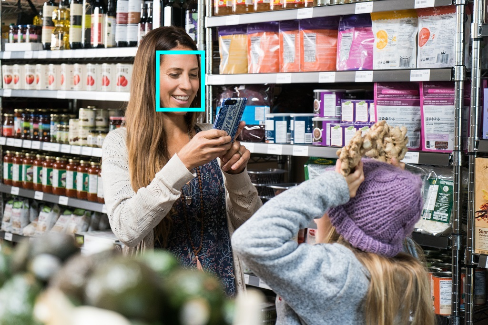

---
lab:
  title: Explorer la reconnaissance faciale
---

# Explorer la reconnaissance faciale

> **Remarque** Pour suivre ce labo, vous avez besoin d’un [abonnement Azure](https://azure.microsoft.com/free?azure-portal=true) dans lequel vous disposez d’un accès administratif.

Les solutions de Vision par ordinateur requièrent souvent une solution d’intelligence artificielle (IA) pour détecter des visages humains. Par exemple, supposons que la société de vente au détail Northwind Traders souhaite localiser des clients dans un magasin pour mieux les assister. Une façon d’y parvenir consiste à déterminer la présence de visages dans les images et, le cas échéant, à identifier les coordonnées du cadre englobant autour des visages.

Pour tester les fonctionnalités du service Visage, nous allons utiliser une simple application de ligne de commande s’exécutant dans le service Cloud Shell. Les mêmes principes et fonctionnalités s’appliquent aux solutions réelles, telles que des sites web ou applications téléphoniques.

## Créer une ressource *API Visage*

Vous pouvez utiliser le service Visage en créant une ressource **Visage**.

Si vous ne l’avez pas déjà fait, créez une ressource **API Visage** dans votre abonnement Azure.

1. Sous un autre onglet de navigateur, ouvrez le portail Azure à l’adresse [https://portal.azure.com](https://portal.azure.com?azure-portal=true) en vous connectant avec votre compte Microsoft.

1. Cliquez sur le bouton **&#65291;Créer une ressource**, recherchez *Visage*, puis créez une ressource **Visage** avec les paramètres suivants :
    - **Abonnement** : *votre abonnement Azure*.
    - **Groupe de ressources** : *sélectionnez ou créez un groupe de ressources portant un nom unique*.
    - **Région** : *choisissez une région disponible*.
    - **Nom** : *entrez un nom unique.*
    - **Niveau tarifaire** : F0 gratuit

1. Examinez et créez la ressource, puis attendez la fin du déploiement. Accédez ensuite à la ressource déployée.

1. Visualisez la page **Clés et point de terminaison** pour votre ressource Visage. Vous aurez besoin du point de terminaison et des clés pour vous connecter à partir d’applications clientes.

## Exécuter Cloud Shell

Pour tester les fonctionnalités du service Visage, nous allons utiliser une simple application de ligne de commande s’exécutant dans le service Cloud Shell sur Azure. 

1. Dans le portail Azure, sélectionnez le bouton **[>_]** (*Cloud Shell*) en haut de la page, à droite de la zone de recherche. Cela a pour effet d’ouvrir un volet de Cloud Shell au bas du portail. 

    

1. Lorsque vous ouvrez le service Cloud Shell première fois, il se peut que vous soyez invité à choisir le type d’interpréteur de commandes que vous souhaitez utiliser (*Bash* ou *PowerShell*). Sélectionnez **PowerShell**. Si vous ne voyez pas cette option, ignorez l’étape.  

1. Si vous êtes invité à créer un stockage pour votre service Cloud Shell, assurez-vous que votre abonnement est spécifié, puis sélectionnez **Créer un stockage**. Patientez ensuite environ une minute jusqu’à ce que le stockage soit créé.

           

1. Assurez-vous que le type d’interpréteur de commandes indiqué en haut à gauche du volet Cloud Shell est *PowerShell*. S’il s’agit de *Bash*, basculez vers *PowerShell* à l’aide du menu déroulant.

     

1. Attendez que PowerShell démarre. Vous devriez voir l’écran suivant s’afficher dans le portail Azure :  

    

## Configurer et exécuter une application cliente

À présent que vous disposez d’un modèle personnalisé, vous pouvez exécuter une simple application cliente utilisant le service Visage.

1. Dans l’interpréteur de commandes, entrez la commande suivante pour télécharger l’exemple d’application et l’enregistrer dans un dossier nommé ai-900.

    ```PowerShell
    git clone https://github.com/MicrosoftLearning/AI-900-AIFundamentals ai-900
    ```

    > **Conseil** Si vous avez déjà utilisé cette commande dans un autre labo pour cloner le dépôt *ai-900*, vous pouvez ignorer cette étape.

1. Les fichiers sont téléchargés dans un dossier nommé **ai-900**. À présent, nous souhaitons voir tous les fichiers de votre stockage Cloud Shell et les utiliser. Tapez la commande suivante dans l’interpréteur de commandes :

     ```PowerShell
    code .
    ```

    Notez que cela a pour effet d’ouvrir un éditeur tel que celui présenté dans l’illustration ci-dessous : 

     

1. Dans le volet **Fichiers** à gauche, développez **ai-900**, puis sélectionnez **find-faces.ps1**. Ce fichier contient du code qui utilise le service Visage pour détecter et analyser les visages présents dans une image, comme illustré ici :

    

1. Ne vous souciez pas trop des détails du code : ce qui importe, c’est qu’il a besoin de l’URL du point de terminaison et de l’une des deux clés de votre ressource Visage. Copiez celles-ci à partir de la page **Clés et points de terminaison** de votre ressource dans le portail Azure, et collez-les dans l’éditeur de code, en remplaçant respectivement les valeurs d’espace réservé **YOUR_KEY** et **YOUR_ENDPOINT**.

    > **Conseil** Vous devrez peut-être vous servir de la barre de séparation pour ajuster la zone d’écran quand vous utilisez les volets **Clés et point de terminaison** et **Éditeur**.

    Une fois les valeurs de clé et de point de terminaison collées, les deux premières lignes de code devraient ressembler à ceci :

    ```PowerShell
    $key="1a2b3c4d5e6f7g8h9i0j...."    
    $endpoint="https..."
    ```

1. En haut à droite du volet de l’éditeur, utilisez le bouton **...** pour ouvrir le menu, puis sélectionnez **Enregistrer** pour enregistrer vos modifications. Rouvrez ensuite le menu, puis sélectionnez **Fermer l’éditeur**.

    L’exemple d’application cliente utilisera votre service Visage pour analyser l’image suivante prise par une caméra dans le magasin de Northwind Traders :

    

1. Dans le volet PowerShell, entrez les commandes suivantes pour exécuter le code :

    ```PowerShell
    cd ai-900
    ./find-faces.ps1 store-camera-1.jpg
    ```

1. Examinez les informations retournées, notamment l’emplacement du visage dans l’image. L’emplacement d’un visage est indiqué par les coordonnées du point supérieur gauche, associées à la largeur et la hauteur d’un *cadre englobant*, comme illustré ici :

    

    >**Remarque** Les fonctionnalités du service Visage qui retournent des caractéristiques d’identification personnelle sont limitées. Pour plus d'informations, consultez https://azure.microsoft.com/blog/responsible-ai-investments-and-safeguards-for-facial-recognition/.

1. Essayons maintenant avec une autre image :

    

    Pour analyser la deuxième image, entrez la commande suivante :

    ```PowerShell
    ./find-faces.ps1 store-camera-2.jpg
    ```

1. Examinez les résultats de l’analyse du visage pour la deuxième image.

1. Essayons avec une image supplémentaire :

    

    Pour analyser la troisième image, entrez la commande suivante :

    ```PowerShell
    ./find-faces.ps1 store-camera-3.jpg
    ```

1. Examinez les résultats de l’analyse du visage pour la troisième image.

## En savoir plus

Cette application simple ne montre que quelques fonctionnalités du service Visage. Pour en savoir plus sur ce que vous pouvez faire avec ce service, consultez la [page de l’API Visage](https://azure.microsoft.com/en-us/products/cognitive-services/vision-services).
