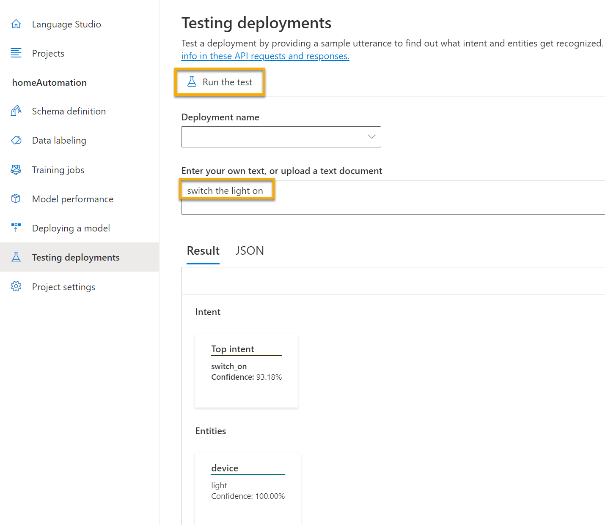

---
lab:
  title: Explorer la compréhension du langage
---

# Explorer la compréhension du langage

> **Remarque** Pour suivre ce labo, vous avez besoin d’un [abonnement Azure](https://azure.microsoft.com/free?azure-portal=true) dans lequel vous disposez d’un accès administratif.

Nous attendons de plus en plus des ordinateurs qu’ils soient capables utiliser l’intelligence artificielle pour comprendre des commandes orales ou écrites en langage naturel. Par exemple, vous pourriez vouloir implémenter un système domotique permettant de contrôler des appareils domestiques à l’aide de commandes vocales telles que « allumer la lumière » ou « allumer le ventilateur », et disposer d’un appareil optimisé par l’IA pour comprendre ces commandes et agir en conséquence.

Pour tester les fonctionnalités du service Conversational Language Understanding, nous allons utiliser une application en ligne de commande qui s’exécute dans Cloud Shell. Les mêmes principes et fonctionnalités s’appliquent aux solutions réelles, telles que des sites web ou applications téléphoniques.

## Créer une ressource du *service Language*

Vous pouvez utiliser le service Conversational Language Understanding en créant une ressource du **service Language**.

Si vous ne l’avez pas déjà fait, créez une ressource du **service Language** dans votre abonnement Azure.

1. Sous un autre onglet de navigateur, ouvrez le portail Azure à l’adresse [https://portal.azure.com](https://portal.azure.com?azure-portal=true) en vous connectant avec votre compte Microsoft.

1. Cliquez sur le bouton **&#65291;Créer une ressource**, recherchez *Service Language*, puis créez une ressource du **service Language** avec les paramètres suivants :
    - Sélectionner des fonctionnalités supplémentaires : *Conservez les fonctionnalités par défaut et cliquez sur Continuer pour créer votre ressource*  
    - **Abonnement** : *votre abonnement Azure*.
    - **Groupe de ressources** : *sélectionnez ou créez un groupe de ressources portant un nom unique*.
    - **Région** : USA Est 2
    - **Nom** : *entrez un nom unique.*
    - **Niveau tarifaire** : S (1 000 appels par minute)
    - **En cochant cette case, je certifie que j’ai vérifié et reconnu les termes dans l’avis sur l’IA responsable** : sélectionné.

1. Examinez et créez la ressource, puis attendez la fin du déploiement.

### Créer une application Conversational Language Understanding

Pour implémenter la compréhension du langage naturel avec Conversational Language Understanding, vous créez une application, puis ajoutez des entités, des intentions et des énoncés afin de définir les commandes que l’application doit exécuter.

1. Sous un nouvel onglet de navigateur, ouvrez le portail Language Studio sur [https://language.azure.com](https://language.azure.com?azure-portal=true) et connectez-vous avec le compte Microsoft associé à votre abonnement Azure.

1. Si vous êtes invité à choisir une ressource de langue, sélectionnez les paramètres suivants :
    - **Annuaire Azure** : annuaire Azure contenant votre abonnement.
    - **Abonnement Azure** : Votre abonnement Azure.
    - **Ressource de langue** : Ressource de langue que vous avez créée précédemment.

    >**Conseil** Si vous n’êtes ***pas*** invité à choisir une ressource Language, cela peut être dû au fait que vous disposez de plusieurs ressources Language dans votre abonnement. Dans ce cas :
    >1. Dans la barre en haut de la page, cliquez sur le bouton **Paramètres (&#9881;)**.
    >1. Dans la page **Paramètres**, recherchez l’onglet **Ressources**.
    >1. Sélectionnez votre ressource Language, puis cliquez sur **Changer de ressource**.
    >1. En haut de la page, cliquez sur **Language Studio** pour retourner à la page d’accueil de Language Studio.

1. En haut du portail, dans le menu **Créer**, sélectionnez **Conversational Language Understanding**.

1. Dans la boîte de dialogue **Créer un projet**, dans la page **Entrer les informations de base**, entrez les détails suivants, puis cliquez sur **Suivant** :
    - **Nom** : *Créer un nom unique*
    - **Description** : domotique simple
    - **Langue principale des énoncés** : anglais
    - **Activer plusieurs langues dans le projet** : *Ne pas sélectionner*

    

    >**Conseil** Notez le *nom de votre projet*, car vous l’utiliserez plus tard.

1. Dans la page *Vérifier et terminer*, cliquez sur **Créer**.

### Créer des intentions, des énoncés et des entités

Une *intention* est une action que vous souhaitez effectuer. Par exemple, vous pouvez souhaiter allumer une lumière ou éteindre un ventilateur. Dans ce cas, vous allez définir deux intentions : l’une pour allumer un appareil, et l’autre pour éteindre un appareil. Pour chaque intention, vous allez spécifier des exemples d’*énoncés* indiquant le type de langage utilisé pour marquer l’intention.

1. Dans le volet **Définition du schéma**, vérifiez que l’option **Intentions** est sélectionnée. Cliquez sur **Ajouter** et ajoutez une intention avec le nom **switch_on** (en minuscules), puis cliquez sur **Ajouter une intention**.

    
    

1. Sélectionnez l’intention **switch_on**. Vous accédez à la page **Étiquetage des données**. Dans la liste déroulante **Intention**, sélectionnez **switch_on**. À côté de l’intention **switch_on**, tapez l’énoncé ***allumer la lumière***, puis appuyez sur **Entrée** pour soumettre cet énoncé à la liste.

    

1. Le service Language a besoin d’au moins cinq exemples d’énoncés différents pour chaque intention afin d’entraîner suffisamment le modèle de langage. Ajoutez cinq autres exemples d’énoncés pour l’intention **switch_on** :  
    - ***allumer le ventilateur***
    - ***mettre le ventilateur en marche***
    - ***allume la lumière***
    - ***allumer la lumière***
    - ***allumer le ventilateur***

1. Dans le volet **Étiquetage d’entités pour l’entraînement** sur le côté droit de l’écran, sélectionnez **Étiquettes**, puis sélectionnez **Ajouter une entité**. Tapez **appareil** (en minuscules), sélectionnez **Liste**, puis sélectionnez **Ajouter une entité**.

     
    

1. Dans l’énoncé ***allumer le ventilateur***, surlignez le mot « ventilateur ». Ensuite, dans la liste qui s’affiche, dans la zone *Rechercher une entité*, sélectionnez **device**.

    

1. Faites de même pour tous les énoncés. Étiquetez le reste des énoncés *ventilateur* ou *lumière* avec l’entité **appareil**. Une fois que vous avez fini, vérifiez que vous disposez des énoncés suivants, puis sélectionnez **Enregistrer les changements** :

    | **intention** | **énoncé** | **entité** |
    | --------------- | ------------------ | ------------------ |
    | switch_on   | Mettre le ventilateur en marche      | Appareil - *sélectionner le ventilateur* |
    | switch_on   | Allumer la lumière    | Appareil - *sélectionner la lumière* |
    | switch_on   | Allumer la lumière | Appareil - *sélectionner la lumière* |
    | switch_on   | Allumer le ventilateur     | Appareil - *sélectionner le ventilateur* |
    | switch_on   | Mettre en route le ventilateur   | Appareil - *sélectionner le ventilateur* |
    | switch_on   | Allumer la lumière   | Appareil - *sélectionner la lumière* |

     

1. Dans le volet de gauche, cliquez sur **Définition du schéma** et vérifiez que votre intention **switch_on** est listée. Cliquez ensuite sur **Ajouter** et ajoutez une nouvelle intention avec le nom **switch_off** (en minuscules).

     

1. Cliquez sur l’intention **switch_off**. Vous accédez à la page **Étiquetage des données**. Dans la liste déroulante **Intention**, sélectionnez **switch_off**. À côté de l’intention **switch_off**, ajoutez l’énoncé ***éteindre la lumière***.

1. Ajoutez cinq autres exemples d’énoncés à l’intention **switch_off**.
    - ***éteindre le ventilateur***
    - ***Arrêter le ventilateur***
    - ***couper la lumière***
    - ***éteindre la lumière***
    - ***couper le ventilateur***

1. Étiquetez les mots *lumière* ou *ventilateur* avec l’entité **appareil**. Une fois que vous avez fini, vérifiez que vous disposez des énoncés suivants, puis sélectionnez **Enregistrer les changements** :  

    | **intention** | **énoncé** | **entité** | 
    | --------------- | ------------------ | ------------------ |
    | switch_off   | Arrêter le ventilateur    | Appareil - *sélectionner le ventilateur* | 
    | switch_off   | Couper la lumière  | Appareil - *sélectionner la lumière* |
    | switch_off   | Éteindre la lumière | Appareil - *sélectionner la lumière* |
    | switch_off   | Couper le ventilateur | Appareil - *sélectionner le ventilateur* |
    | switch_off   | Désactiver le ventilateur | Appareil - *sélectionner le ventilateur* |
    | switch_off   | Éteindre la lumière | Appareil - *sélectionner la lumière* |

### Effectuer l’apprentissage du modèle

Vous êtes maintenant prêt à utiliser les intentions et entités que vous avez définies afin d’effectuer l’apprentissage du modèle de langage conversationnel pour votre application.

1. Dans la partie gauche de Language Studio, sélectionnez **Tâches d’entraînement**, puis **Démarrer un travail d’entraînement**. Utilisez les paramètres suivants : 
    - **Former un nouveau modèle** : *Sélectionnez et choisissez un nom de modèle*
    - **Mode d’entraînement** : Entraînement standard (gratuit)
    - **Division des données** : *sélectionnez Séparer automatiquement le jeu de test des données d’entraînement, conservez les pourcentages par défaut*
    - Cliquez sur **Former** au bas de la page.

1. Attendez la fin de l’entraînement. 

### Déployer et tester le modèle

Pour utiliser votre modèle entraîné dans une application cliente, vous devez le déployer en tant que point de terminaison auquel les applications clientes peuvent envoyer de nouveaux énoncés à partir desquels les intentions et les entités seront prédites.

1. Dans la partie gauche de Language Studio, cliquez sur **Déploiement d’un modèle**.

1. Sélectionnez le nom de votre modèle, puis cliquez sur **Ajouter un déploiement**. Utilisez les paramètres suivants :
    - **Créer ou sélectionner un nom de déploiement existant** : *sélectionnez Créer un nom de déploiement. Ajoutez un nom unique*.
    - **Attribuer un modèle entraîné à votre nom de déploiement** : *sélectionnez le nom du modèle entraîné*.
    - Cliquez sur **Déployer**.

    >**Conseil** Notez le *nom de votre déploiement*, car vous l’utiliserez plus tard. 

1. Une fois le modèle déployé, cliquez sur **Test des déploiements** dans la partie gauche de la page, puis sélectionnez votre modèle déployé sous **Nom du déploiement**.

1. Entrez le texte suivant, puis sélectionnez **Exécuter le test** :

    *allumer la lumière*

     

    Passez en revue le résultat retourné, en notant qu’il inclut l’intention prédite (qui doit être **switch_on**) et l’entité prédite (**appareil**) avec des scores de confiance qui indiquent la probabilité calculée par le modèle pour l’intention et l’entité prédites. L’onglet JSON montre la confiance comparative pour chaque intention potentielle (celle qui a le score de confiance le plus élevé est l’intention prédite)

1. Effacez la zone de texte, puis testez le modèle avec les énoncés suivants sous *Entrez votre propre texte ou chargez un document texte* :
    - *éteindre le ventilateur*
    - *allume la lumière*
    - *Arrêter le ventilateur*

## Exécuter Cloud Shell

Nous allons maintenant essayer votre modèle déployé. Pour ce faire, nous allons utiliser une application en ligne de commande qui s’exécute dans Cloud Shell sur Azure. 

1. Tout en gardant l’onglet de navigateur avec Language Studio ouvert, revenez à l’onglet de navigateur contenant le portail Azure.

1. Dans le portail Azure, sélectionnez le bouton **[>_]** (*Cloud Shell*) en haut de la page, à droite de la zone de recherche. Quand vous cliquez sur le bouton, un volet Cloud Shell s’ouvre au bas du portail.

    

1. Lorsque vous ouvrez le service Cloud Shell première fois, il se peut que vous soyez invité à choisir le type d’interpréteur de commandes que vous souhaitez utiliser (*Bash* ou *PowerShell*). Sélectionnez **PowerShell**. Si vous ne voyez pas cette option, ignorez l’étape.  

1. Si vous êtes invité à créer un stockage pour votre service Cloud Shell, assurez-vous que votre abonnement est spécifié, puis sélectionnez **Créer un stockage**. Patientez ensuite environ une minute jusqu’à ce que le stockage soit créé. 

    

1. Assurez-vous que le type d’interpréteur de commandes indiqué en haut à gauche du volet Cloud Shell est *PowerShell*. S’il s’agit de *Bash*, basculez vers *PowerShell* à l’aide du menu déroulant.

     

1. Attendez que PowerShell démarre. Vous devriez voir l’écran suivant s’afficher dans le portail Azure :  

     

## Configurer et exécuter une application cliente

Ouvrons et modifions à présent un script écrit au préalable, qui va exécuter l’application cliente.

1. Dans l’interpréteur de commandes, entrez la commande suivante pour télécharger l’exemple d’application et l’enregistrer dans un dossier nommé ai-900.

    ```PowerShell
    git clone https://github.com/MicrosoftLearning/AI-900-AIFundamentals ai-900
    ```

    >**Remarque** Si vous avez déjà utilisé cette commande dans un autre labo pour cloner le dépôt *ai-900*, vous pouvez ignorer cette étape.

1. Les fichiers sont téléchargés dans un dossier nommé **ai-900**. Nous souhaitons à présent voir tous les fichiers de ce dossier et les utiliser. Tapez les commandes suivantes dans l’interpréteur de commandes :

     ```PowerShell
    cd ai-900
    code .
    ```

    Notez que le script ouvre un éditeur tel que celui présenté dans l’image ci-dessous : 

    

1. Dans le volet **Fichiers** sur la gauche, sélectionnez le fichier **understand.ps1** dans le dossier **ai-900**. Ce fichier contient du code qui utilise votre modèle Conversational Language Understanding. 

    

    Ne vous souciez pas trop des détails du code. Ce qui importe, c’est que vous allez utiliser les instructions ci-dessous pour modifier le fichier afin de spécifier le modèle de langage que vous avez entraîné. 

1. Revenez à l’onglet de navigateur contenant **Language Studio**. Puis, dans Language Studio, ouvrez la page **Déploiement d’un modèle**, et sélectionnez votre modèle. Cliquez ensuite sur le bouton **Obtenir l’URL de prédiction**. Les deux informations dont vous avez besoin se trouvent dans cette boîte de dialogue :
    - Point de terminaison de votre modèle - Vous pouvez copier le point de terminaison à partir de la zone **URL de prédiction**.
    - Clé de votre modèle - La clé se trouve dans l’**exemple de requête** en tant que valeur du paramètre **Ocp-Apim-Subscription-Key**, et ressemble à ceci : ***0ab1c23de4f56gh7i8901234jkl567m8***.

1. Copiez la valeur du point de terminaison, revenez à l’onglet de navigateur contenant Cloud Shell, puis collez cette valeur dans l’éditeur de code à la place de **YOUR_ENDPOINT** (entre guillemets). Répétez ce processus pour la clé, en remplaçant **YOUR_KEY**.

1. Ensuite, remplacez **YOUR_PROJECT_NAME** par le nom de votre projet et remplacez **YOUR_DEPLOYMENT_NAME** par le nom de votre modèle déployé. Les premières lignes de code doivent ressembler à ce que vous voyez ci-dessous :

    ```PowerShell
    $endpointUrl="https://some-name.cognitiveservices.azure.com/language/..."
    $key = "0ab1c23de4f56gh7i8901234jkl567m8"
    $projectName = "name"
    $deploymentName = "name"
    ```

1. En haut à droite du volet de l’éditeur, utilisez le bouton **...** pour ouvrir le menu, puis sélectionnez **Enregistrer** pour enregistrer vos modifications. Rouvrez ensuite le menu, puis sélectionnez **Fermer l’éditeur**.

1. Dans le volet PowerShell, entrez la commande suivante pour exécuter le code :

    ```PowerShell
    ./understand.ps1 "Turn on the light"
    ```

1. Passez en revue les résultats. L’application devrait avoir prédit que l’intention de l’action est d’allumer la lumière.

1. Essayez maintenant une autre commande :

    ```PowerShell
    ./understand.ps1 "Switch the fan off"
    ```

1. Examinez les résultats de cette commande. L’application devrait avoir prédit que l’intention de l’action est d’éteindre le ventilateur.

1. Expérimentez quelques commandes supplémentaires. y compris des commandes que le modèle n’a pas appris à prendre en charge, telles que « Hello » ou « Allumer le four ». L’application doit généralement comprendre les commandes pour lesquelles son modèle de langage est défini, et échouer avec élégance pour d’autres entrées.

>**Remarque** Vous devez à chaque fois commencer par **./understand.ps1** suivi de l’expression. Placez votre expression entre guillemets.

## En savoir plus

Cette application montre uniquement certaines des capacités de la fonctionnalité Conversational Language Understanding du service Language. Pour en savoir plus sur ce que ce service est capable de faire, consultez la [page Conversational Language Understanding](https://docs.microsoft.com/azure/cognitive-services/language-service/conversational-language-understanding/overview). 
